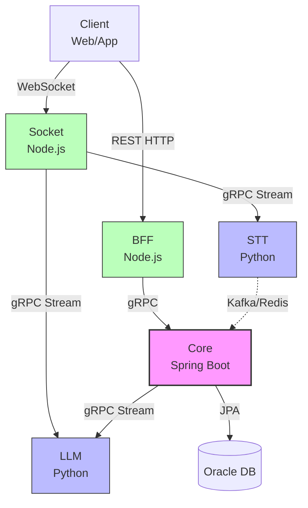

# 핵심 기술 의사결정 1: Polyglot MSA 아키텍처 및 gRPC 통신 최적화 과정

## 1. 배경 및 문제 상황 (도메인 특성의 충돌)

초기 단일 언어(Monolith) 기반으로 시스템을 설계하려 했을 때, AI 면접 서비스 내 각 도메인이 요구하는 **기술적 특성과 워크로드 패턴이 완전히 다르다**는 문제에 직면했습니다.

1.  **Core 도메인 (세션 관리, 면접 상태, 트랜잭션):**
    - 면접의 상태(진행 시간, 단계 등)를 엄격하게 관리하고, 사용자/면접 기록 관리를 위한 RDBMS(JPA)와의 통신이 잦았습니다.
    - 데이터의 정합성과 풍부한 객체 지향적 도메인 모델링(Clean Architecture)이 필수적이었습니다.
2.  **Socket/API Gateway 도메인 (실시간 통신 및 라우팅):**
    - 사용자의 오디오 스트림과 실시간 자막(Pub/Sub) 이벤트를 수만 개의 커넥션 위에서 끊김 없이(Non-blocking I/O) 처리해야 했습니다.
3.  **AI 파이프라인 (STT, TTS, LLM):**
    - 무거운 딥러닝 모델(Whisper, 임베딩, LangGraph) 추론을 수행해야 하므로 Python 생태계가 강제되었습니다.

이를 단일 언어나 프레임워크로 통합하면 특정 도메인의 성능 병목이 전체 시스템의 장애로 이어지고, AI 모델 통합 과정에서 브릿지(Bridge) 라이브러리로 인한 불필요한 오버헤드가 발생할 것이 자명했습니다.

---

## 2. 해결 방안: 도메인 주도 Polyglot MSA 설계

각 도메인의 특성을 극대화하기 위해 완전한 책임 분리가 이루어진 8개의 마이크로서비스 아키텍처(MSA)를 구성하고, 언어적 장점을 취하는 **Polyglot 전략**을 택했습니다.



### 2.1 마이크로서비스 역할 및 채택 기술

| 서비스명    | 채택 언어/프레임워크   | 채택 사유 (의사결정)                                                                              |
| :---------- | :--------------------- | :------------------------------------------------------------------------------------------------ |
| **BFF**     | Node.js (NestJS)       | JWT 인증, REST 기반 프론트엔드 API 게이트웨이 역할. 빠른 I/O 처리에 유리.                         |
| **Core**    | **Java (Spring Boot)** | 복잡한 비즈니스 로직(세션, 인터랙션, 상태 머신) 제어 및 영속성(JPA) 관리. **Control Tower 역할**. |
| **Socket**  | Node.js (NestJS)       | Socket.IO 기반 WebSocket 스트리밍. 동시 접속자 양방향 통신(Non-blocking)에 최적화.                |
| **LLM**     | **Python (FastAPI)**   | LangChain, LangGraph 기반의 AI 워크플로우 오케스트레이션 및 프롬프트 추론에 필수적임.             |
| **STT**     | Python (gRPC)          | Whisper 모델을 활용한 음성-텍스트 변환 추론. (GPU/CPU 연산 집약적)                                |
| **TTS**     | Python                 | 텍스트-음성 변환 서빙. (비동기 큐 워커 형태)                                                      |
| **Storage** | Python                 | Object Storage 업로드를 처리하는 백그라운드 워커.                                                 |

---

## 3. 네트워크 바운더리 극복: HTTP REST 대신 gRPC 전면 도입

Polyglot MSA의 가장 큰 부작용은 서비스 간 통신 과정에서 발생하는 **네트워크 직렬화/역직렬화 오버헤드**입니다. особенно 실시간 음성 데이터를 주고받는 AI 면접의 특성상 밀리초 단위의 지연(Latency)이 치명적이었습니다.

### 3.1 HTTP/JSON 한계 극복

일반적인 HTTP/1.1 REST API는 JSON 형태로 데이터를 주고받습니다. JSON은 사람이 읽기엔 좋지만, 데이터 페이로드가 크고 텍스트 파싱에 막대한 CPU 자원과 시간을 소모합니다.

```text
[ ASCII Art: HTTP vs gRPC 오버헤드 비교 ]

[ AS-IS: HTTP/JSON ]
Service A  ────────(JSON 문자열 전송)────────▶  Service B
           파싱 (무거움)                    언패킹/파싱 (무거움)

[ TO-BE: gRPC/Protobuf ]
Service A  ════════(Binary Stream 전송)════════▶  Service B
           직렬화 (가벼움)                   역직렬화 (가벼움)
```

### 3.2 Protocol Buffers(Protobuf)와 gRPC 채택

이 문제를 해결하고자 내부망 서비스 간 통신(Core ↔ LLM, Socket ↔ STT 등)에 **gRPC를 전면 도입**했습니다.

1.  **Binary Serialization**: Protobuf를 사용하여 JSON 대비 페이로드 크기를 획기적으로 압축했고, 파싱 속도를 끌어올렸습니다.
2.  **HTTP/2 기반 스트리밍**: `Socket -> STT`, `Core -> LLM` 구간에서 단일 커넥션으로 양방향(Bi-directional) 스트리밍 처리가 가능해졌습니다. 오디오 청크를 실시간으로 쏘고, LLM 토큰을 실시간으로 가져오는 데 핵심적인 역할을 했습니다.
3.  **명확한 Interface Contract**: `services/proto` 디렉토리 하위에 모든 API 규약을 `*.proto` 파일로 중앙화했습니다. Java, Node.js, Python 각각 컴파일 스크립트만 다를 뿐, 단일 진실의 원천(SSOT)을 바탕으로 언어 간 타입 불안정성을 완벽히 해소했습니다.

### 3.3 구현 단계의 최적화 (Keep-Alive)

실제 운영 과정에서 긴 면접 시간 동안 아무 말도 하지 않았을 때(침묵) 스트림 커넥션이 끊어지는 문제가 발생했습니다. 이를 방지하기 위해 각 gRPC 클라이언트에 정교한 Keep-Alive 설정을 추가했습니다.

- `Socket ↔ STT`: `grpc.keepalive_time_ms: 10000`, `permit_without_calls: true` 로 10초마다 핑을 날려 세션당 단일 스트림을 끈질기게 유지했습니다.
- `Core ↔ LLM`: Spring Boot의 `enable-keep-alive: true` 속성을 도입해 컨텍스트 푸시 간 유휴 시간의 연결 유실을 막았습니다.

---

## 4. 최종 결과 및 의의

1.  **지연 시간(Latency) 최소화:** 이종 언어 간(Node.js -> Java -> Python) 통신임에도 페이로드 직렬화 오버헤드가 사실상 사라져 통신 지연을 평균 **20ms 이하**로 엄격하게 통제할 수 있었습니다.
2.  **독립적 확장(Scale-out):** STT 등 트래픽과 CPU 소모가 급증하는 AI 파이프라인 파드(Pod)만 독립적으로 스케일링할 수 있는 유연한 쿠버네티스 배포 구조를 확립했습니다.
3.  **경계가 명확한 설계:** gRPC `proto` 파일 정의 자체가 설계의 시작점이 되면서, 백엔드 개발 과정에서 서비스 간 R&R(역할과 책임) 논란이 사라지고 개발 생산성이 비약적으로 향상되었습니다.
