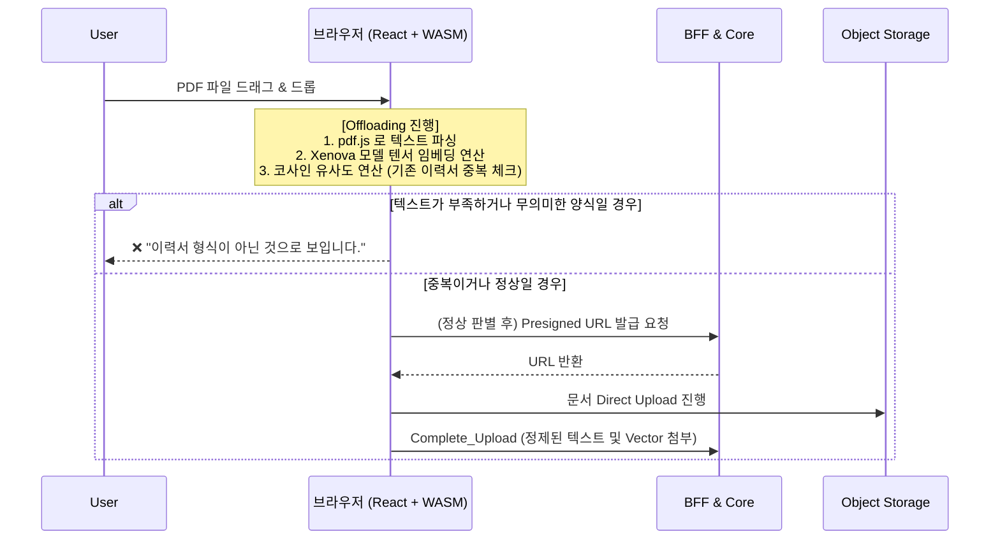

# 핵심 기술 의사결정 5: 브라우저 오프로딩을 통한 무의미한 서버 리소스 낭비 원천 차단

## 1. 배경 및 문제 상황 (6 OCPU 서버의 방어막 부재)

AI 면접관의 정확도를 높이고자 사용자에게 입사지원서(Resume)를 PDF 형태나 직접 텍스트로 업로드할 수 있는 기능을 제공했습니다.

하지만 **"이 텍스트(문서)가 실제로 이력서 양식을 갖추고 있는가?" (Validation)** 그리고 **"기존에 이미 업로드했던 동일한 이력서를 또다시 스팸성으로 업로드하는가?" (Duplication Check)** 두 가지 검증 요구 사항이 대두되었습니다.

초기에 이를 서버(Python FastAPI/Spring Boot)로 전부 떠넘겼을 경우의 위험성은 다음과 같았습니다.

1. 문서를 서버로 전부 올려서 PDF 파싱 라이브러리(Extract)를 돌리고, Xenova 같은 거대한 텍스트 임베딩 모델(Embedding)을 구동해 코사인 유사도(Cosine Similarity)를 돌려야 합니다.
2. 현재 오라클 Free Tier 한계 극복을 위해 쥐어짠 6 OCPU 풀 안에서, 만약 악의적인 사용자가 10MB짜리 쓸데없는 악성 이미지/텍스트 PDF를 연속으로 업로드하며 파이프라인을 두드린다면 **귀중한 CPU와 Memory 리소스가 불필요한 포맷 파싱 및 임베딩 벡터 생성에 증발해버릴 위험**이 컸습니다. 진짜 AI 면접 추론에 쓰여야 할 컴퓨팅 파워가 빼앗기게 되는 꼴이었습니다.

---

## 2. 해결 방안: 클라이언트-사이드 브라우저 오프로딩 적용 (Frontend WASM)

서버가 감당해야 할 1차 텍스트 파싱과 다차원 텐서 임베딩/유사도 연산 책임을 사용자의 로컬 환경, 즉 **브라우저의 JavaScript/WASM 엔진으로 전면 오프로딩(Off-loading)**하는 아키텍처 전략을 내세웠습니다.

```text
[ ASCII Art: 서버 보호 및 리소스 절감 효과 ]

[ AS-IS: 서버 집중형 검증 ]
악성/스팸 ───────(10MB 전송)───────▶ [ Core 서버 ]
사용자 PDF                            - PDF 파싱 (CPU 급상승)
                                     - 임베딩 연산 (메모리 고갈)
                                     - 결과 통보 (❌)

[ TO-BE: 브라우저 오프로딩 ]
악성/스팸 ──▶ [ 브라우저 (WASM) ] ──(사전 차단)── X (서버로 전송 안됨!)
사용자 PDF      - 로컬 파싱
               - 로컬 임베딩 연산
               - 코사인 유사도 검사
                    │
              (통과 시에만)
                    ▼
               [ Core 서버 ] (평온함, 0% CPU 낭비)
```

### 2.1 PDF/DOXC 파싱 연산 전가 (pdfjs-dist, mammoth)

- 사용자가 파일을 드래그 영역(`ResumeUploadZone.tsx`)에 올리는 순간, 파일은 서버로 전송되지 않습니다.
- 클라이언트 단에서 `pdfjs-dist` 모듈(설정된 웹 워커 `pdf.worker.min.mjs` 사용)을 곧바로 돌려서, 즉석에서 이진(Binary) PDF 데이터를 분석하여 순수 Text String을 뽑아냅니다. (한글 파싱 시 `cMapPacked` 활용으로 인코딩 훼손까지 방지)
- 텍스트 글자 수가 비정상적으로 짧거나 파일이 깨졌다면 **서버로 HTTP 패킷 통신조차 보내지 않고 그 자리에서 Error 컴포넌트를 반환하여 차단**합니다. Network 트래픽 절약의 효과까지 누릴 수 있습니다.

### 2.2 클라이언트 사이드 AI 모델 임베딩 (Xenova/transformers)

- 단순 텍스트 길이 검증을 넘어서 "진짜 이력서가 맞는가?"를 알아내기 위해, 브라우저 다운로드 캐시(`useBrowserCache: true`)를 사용한 **브라우저 내부 AI 모델(MiniLM-L12-v2) 파이프라인**을 띄웠습니다 (`resume-validator.ts`).
- 뽑아낸 텍스트를 로컬에서 PII 마스킹(이메일, 연락처 노출 방지) 처리한 다음, 앵커 텍스트(`ANCHOR_TEXT` - 이력서 형식을 모방한 교보재 텍스트)의 임베딩 벡터와 코사인 유사도를 직접 브라우저에서 돌립니다.
- 동시에, 기존 로그인된 사용자의 이력서 임베딩 리스트와 로컬에서 실시간 대조하여 0.85 이상의 텐서 일치 시 "중복된 이력서입니다"라고 브라우저에서 Alert를 띄우며(Duplication 방어), **동일 텍스트 업로드를 위한 중복 Presigned URL 요청을 원천 무효화**시킵니다.

---

## 3. 구조적 다이어그램 (Resume Upload Flow)



---

## 4. 최종 결과 및 의의

- **서버 인프라 보호 완성**: 이 구조를 통해 아무 문서나 던져대는 브루트포스(무차별 대입) 혹은 악성 쓰레기문서 업로드 파일들은 **단 1Byte도 서버 파이프라인(Network)에 닿기 전에 사용자의 개인 브라우저 자원을 갈궈 스스로 소멸**하게 됩니다. 이는 Core 서버가 AI 면접 등 비즈니스 로직에만 100% 자원을 집중시킬 수 있게 하는 거대한 쉴드가 되었습니다.
- **연산량 대전환**: 거대한 텍스트의 텐서 임베딩 연산 작업 비용을 프로젝트 OCI 계정에서 **End-User의 데스크톱/모바일 CPU & GPU 로 완전히 넘겼다는 점(Decentralization)**에서 클라이언트 사이드 렌더링(CSR)과 Web Assembly를 AI 연산에 접목한 선진적인 사례를 남겼습니다.
- **즉각적인 피드백 UX 마련**: 화면 깜빡임이나 백엔드 대기 로딩 바(Loader) 없이, 파일을 잡고 내려놓자마자 `js` 스레드가 브라우저의 강력한 자원을 써먹으면서 "이건 이력서가 아닙니다"라는 검증 피드백을 밀리초(ms) 이내에 폭포수처럼 쏟아내도록 UX를 극적으로 향상시켰습니다.
