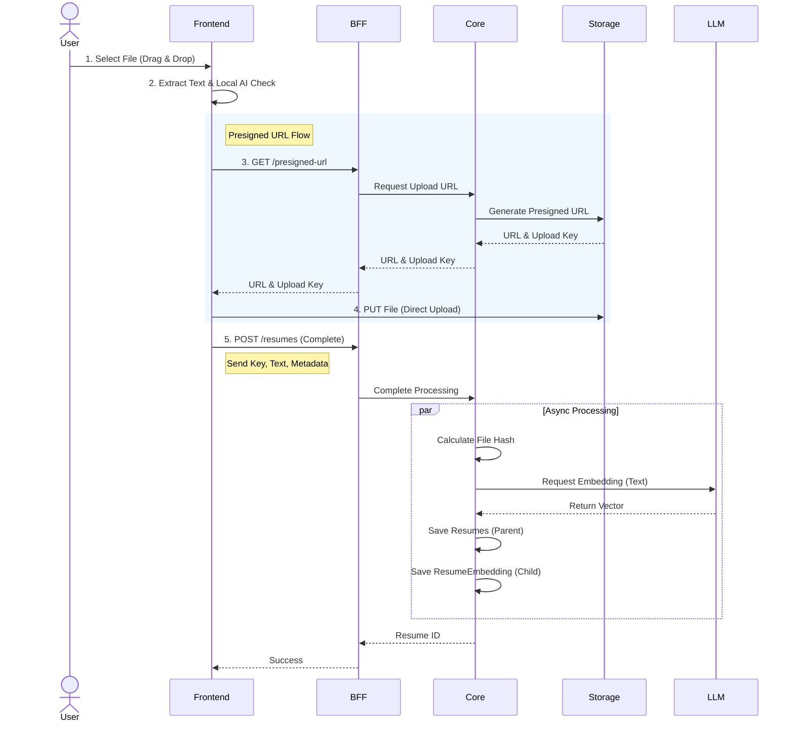
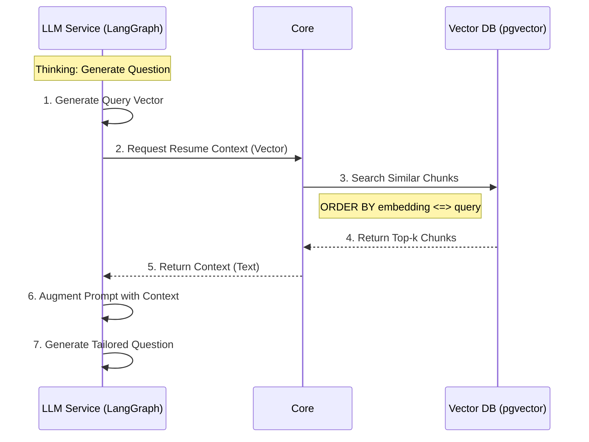

# 이력서(Resume) RAG 아키텍처 및 구현 상세

본 문서는 **이력서 기반 AI 면접 시스템**의 전체 아키텍처와 구현 상세를 기술합니다.
프론트엔드 검증부터 벡터 DB 저장, RAG(Retrieval-Augmented Generation) 검색에 이르는 전 과정을 다룹니다.

---

## 1. 아키텍처 오버뷰 (High-Level Architecture)


### 핵심 컴포넌트

1.  **Frontend (React/Vite)**
    - **역할**: 파일 업로드, 텍스트 추출, 로컬 AI(Transformers.js) 1차 검증, PII(개인정보) 마스킹.
    - **특징**: 사용자 경험(UX) 최적화 및 불필요한 서버 부하 방지.

2.  **BFF (NestJS)**
    - **역할**: API 게이트웨이, 인증/인가, 데이터 중계.
    - **통신**: REST API (Client) ↔ gRPC (Microservices).

3.  **Core Service (Spring Boot)**
    - **역할**: 도메인 로직, RAG 데이터 관리, 면접 상태 관리.
    - **DB**: PostgreSQL (pgvector) / Oracle (Vector Search) - **하이브리드 지원**.
    - **구조**: 1(파일) : N(청크) 구조의 RAG 최적화 설계.

4.  **LLM Service (Python/FastAPI)**
    - **역할**: 임베딩 생성(Embedding), 면접 질문 생성(Generation).
    - **통신**: gRPC Streaming.

5.  **Storage Service (Python/gRPC)**
    - **역할**: 이력서 원본 파일(PDF/Word) 및 이미지 저장 (MinIO/S3).

---

## 2. 상세 구현 (Implementation Details)

### 2.1 Frontend: 지능형 업로드 및 로컬 검증

- **위치**: `frontend/src/services/resume-validator.ts`
- **로직**:
  1.  **Text Extraction**: `pdfjs-dist`로 브라우저 내에서 텍스트 추출.
  2.  **Local AI**: `Xenova/bert-base-multilingual-cased-mnli` 모델(ONNX)을 로드하여 이력서 여부 판별.
      - **Zero-shot Classification**: 문맥을 분석하여 "Resume" vs "Other" 분류.
      - **Privacy**: 서버 전송 전 로컬에서 필터링하여 민감 정보 보호 강화.
  3.  **PII Masking**: 정규식을 통해 전화번호, 이메일 등을 마스킹 처리 (`[EMAIL]`, `[PHONE]`).

### 2.2 Core Service: RAG 아키텍처 (Backend)

- **위치**: `services/core/src/main/java/me/unbrdn/core/resume/`

#### (1) Parent-Child Entity 구조

RAG의 정확도를 높이기 위해 파일 관리와 지식 저장을 분리했습니다.

```java
// Parent: 파일 관리
@Entity
public class Resumes {
    @Id private Long id;
    private String fileHash; // 중복 방지 (SHA-256)
    // embedding 컬럼 제거됨
}

// Child: 지식 청크 (RAG용)
@Entity
public class ResumeEmbedding {
    @Id private Long id;

    @ManyToOne
    private Resumes resume; // Parent 참조

    @Column(columnDefinition = "TEXT")
    private String content; // 텍스트 조각

    @Column(columnDefinition = "vector")
    @JdbcTypeCode(SqlTypes.VECTOR)
    private float[] embedding; // 1536차원 벡터

    private String category; // PROJECT, SKILL, EDUCATION 등
}
```

#### (2) 벡터 검색 (Repository)

`pgvector`의 코사인 거리(`<=>`) 연산자를 활용한 Native Query 구현.

```sql
SELECT * FROM resume_embeddings
WHERE resume_id = :resumeId
ORDER BY embedding <=> :queryVector
LIMIT 3
```

- **의미**: 해당 지원자의 이력서 내용 중에서, 질문과 의미적으로 가장 가까운 3개의 텍스트 조각을 가져옴.

### 2.3 LLM Service: 임베딩 생성

- **위치**: `services/llm/service/llm_service.py`
- **기술**: OpenAI `text-embedding-3-small` (1536차원) 또는 로컬 임베딩 모델 호환.
- **프로세스**:
  1.  Core가 gRPC로 텍스트 전송.
  2.  LLM 서비스가 벡터 생성 후 반환.

---

## 3. 데이터 흐름 (Data Flow)

### Scenario: 이력서 업로드 (Presigned URL)

1.  **User**: 파일 드래그 & 드롭.
2.  **Frontend**:
    - 텍스트 추출 -> 로컬 AI 검증 -> PII 마스킹.
    - **Core**: `GET /resumes/presigned-url` 요청 (Upload Key 획득).
    - **Storage**: 획득한 URL로 파일 직접 업로드 (`PUT`).
3.  **Frontend**: 업로드 완료 후 **Core**에 `POST /resumes` 요청 (Key & 텍스트 전달).
4.  **Core**:
    - `fileHash` 중복 체크.
    - LLM 서비스에 텍스트 전송 -> 임베딩 벡터 수신.
    - `Resumes` 및 `ResumeEmbedding` 저장.
    - (Option) 업로드된 파일의 유효성 비동기 검증.



### Scenario: AI 면접관 질문 생성 (RAG)

1.  **LLM Service**: "지원자의 프로젝트 경험에 대해 질문해줘" (Thinking).
2.  **Core**: 질문을 벡터화 -> `ResumeEmbeddingRepository` 검색 (Category='PROJECT' 필터링 가능).
3.  **DB**: 가장 유사한 프로젝트 경험 텍스트 청크 반환.
4.  **Core**: 검색된 청크(Context)를 LLM에 프롬프트로 주입.
5.  **LLM Service**: 컨텍스트 기반의 정교한 꼬리질문 생성.



---

## 4. 인프라 및 배포 (Infrastructure)

- **Database**:
  - **Local**: PostgreSQL 16 + `pgvector` (Docker).
  - **Prod**: Oracle Autonomous Database + `Vector Search` (Hybrid 호환).
- **ORM**: Hibernate 6.x + `pgvector-java` 라이브러리 (표준화된 벡터 타입 처리).
- **Storage**: MinIO (Local) / Oracle Object Storage (Prod).

---

## 5. 향후 로드맵

1.  **Smart Chunking**: 현재는 전체 텍스트(`FULL_TEXT`) 위주이나, `DocumentParser`를 고도화하여 문단/섹션 단위 자동 분할 구현 예정.
2.  **Hybrid Search**: 키워드 검색(BM25)과 벡터 검색(Dense)을 결합하여 검색 정확도 향상 (`Reciprocal Rank Fusion`).
