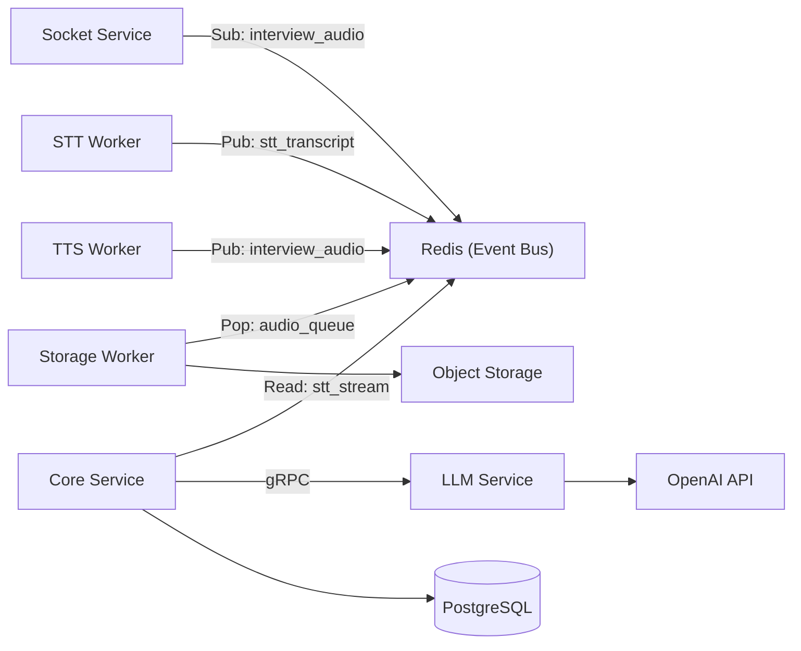
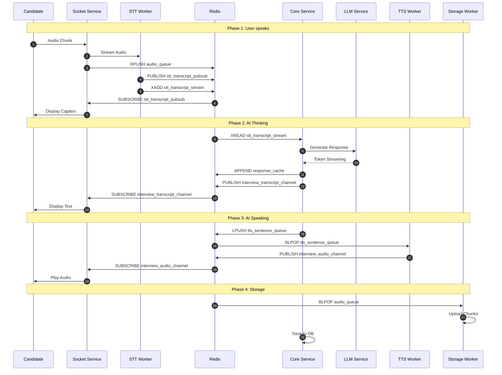
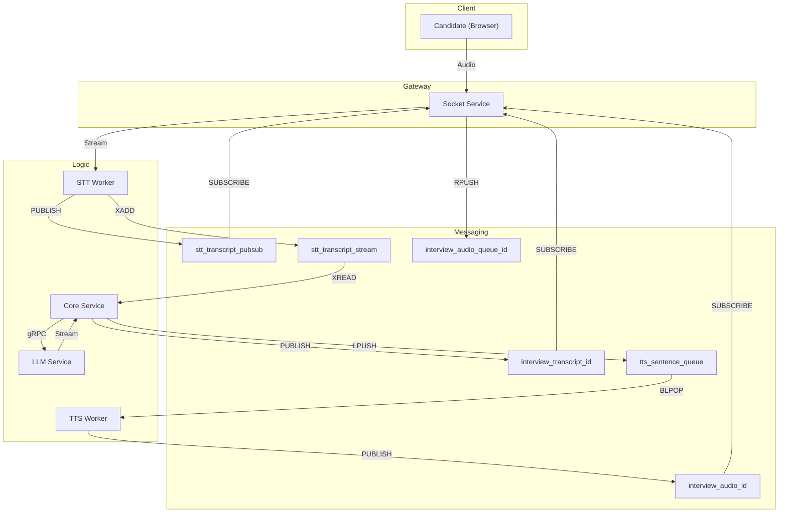

# 아키텍처 다이어그램

이 문서는 시스템 아키텍처를 시각화한 다이어그램들을 포함합니다. 모든 흐름은 Redis와 gRPC를 기반으로 합니다.

---

## 시스템 아키텍처 (전체 구조)

```mermaid
flowchart LR
    Socket["Socket Service"]
    Redis["Redis (Event Bus)"]
    Core["Core Service"]
    LLM["LLM Service"]
    STT["STT Worker"]
    TTS["TTS Worker"]
    Storage["Storage Worker"]

    Socket -- "Sub: interview_audio" --> Redis
    STT -- "Pub: stt_transcript" --> Redis
    TTS -- "Pub: interview_audio" --> Redis
    Storage -- "Pop: audio_queue" --> Redis

    Core -- "Read: stt_stream" --> Redis
    Core -- "gRPC" --> LLM

    Storage --> ObjStorage["Object Storage"]
    Core --> DB[(PostgreSQL)]
    LLM --> OpenAI["OpenAI API"]
```

---

## 실시간 면접 플로우 (시퀀스 다이어그램)

```mermaid
sequenceDiagram
    autonumber
    participant C as Candidate
    participant S as Socket Service
    participant STT as STT Worker
    participant R as Redis
    participant CS as Core Service
    participant LLM as LLM Service
    participant TTS as TTS Worker
    participant SW as Storage Worker

    Note over C, SW: Phase 1: User speaks
    C->>S: Audio Chunk
    S->>STT: Stream Audio
    S->>R: RPUSH audio_queue
    STT->>R: PUBLISH stt_transcript_pubsub
    STT->>R: XADD stt_transcript_stream
    R->>S: SUBSCRIBE stt_transcript_pubsub
    S->>C: Display Caption

    Note over C, SW: Phase 2: AI Thinking
    R->>CS: XREAD stt_transcript_stream
    CS->>LLM: Generate Response
    LLM-->>CS: Token Streaming
    CS->>R: APPEND response_cache
    CS->>R: PUBLISH interview_transcript_channel
    R->>S: SUBSCRIBE interview_transcript_channel
    S->>C: Display Text

    Note over C, SW: Phase 3: AI Speaking
    CS->>R: LPUSH tts_sentence_queue
    R->>TTS: BLPOP tts_sentence_queue
    TTS->>R: PUBLISH interview_audio_channel
    R->>S: SUBSCRIBE interview_audio_channel
    S->>C: Play Audio

    Note over C, SW: Phase 4: Storage
    R->>SW: BLPOP audio_queue
    SW->>SW: Upload Chunks
    CS->>CS: Save to DB
```

---

## 이벤트 기반 아키텍처 (상세 플로우)

```mermaid
flowchart TD
    subgraph Client
        Candidate["Candidate (Browser)"]
    end

    subgraph Gateway
        Socket["Socket Service"]
    end

    subgraph Messaging
        R_STT_PS["stt_transcript_pubsub"]
        R_STT_ST["stt_transcript_stream"]
        R_LLM_PS["interview_transcript_id"]
        R_TTS_Q["tts_sentence_queue"]
        R_AUD_Q["interview_audio_queue_id"]
        R_AUD_PS["interview_audio_id"]
    end

    subgraph Logic
        STT["STT Worker"]
        Core["Core Service"]
        LLM["LLM Service"]
        TTS["TTS Worker"]
    end

    Candidate -- Audio --> Socket
    Socket -- Stream --> STT
    Socket -- RPUSH --> R_AUD_Q

    STT -- PUBLISH --> R_STT_PS
    STT -- XADD --> R_STT_ST
    R_STT_PS -- SUBSCRIBE --> Socket

    R_STT_ST -- XREAD --> Core
    Core -- gRPC --> LLM
    LLM -- Stream --> Core

    Core -- PUBLISH --> R_LLM_PS
    R_LLM_PS -- SUBSCRIBE --> Socket

    Core -- LPUSH --> R_TTS_Q
    R_TTS_Q -- BLPOP --> TTS
    TTS -- PUBLISH --> R_AUD_PS
    R_AUD_PS -- SUBSCRIBE --> Socket
```
