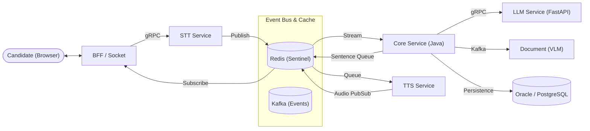
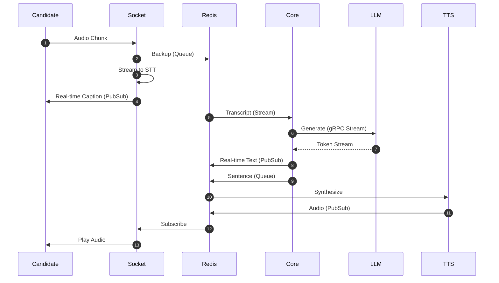

# 🏗️ AI Interview Solution Architecture

본 문서는 프로젝트의 전체 시스템 아키텍처와 데이터 흐름, 에러 처리 전략을 정의하는 **단일 진입점(Single Source of Truth)**입니다.

---

## 1. 시스템 개요 (Overview)

- **핵심 패턴**:
  - **실시간 스트리밍**: Redis (Streams, Queue, Pub/Sub) 및 gRPC Streaming 기반
  - **이벤트 기반**: Kafka를 통한 비동기 상태 동기화 및 후처리
- **주요 서비스 역할**:
  - **BFF (Node.js/NestJS)**: 클라이언트 통신(REST), 인증(JWT), API 게이팅
  - **Core (Java/Spring Boot)**: 비즈니스 도메인 로직, 면접 상태 관리, 데이터 영속성 (Oracle/PostgreSQL)
  - **Socket (Node.js/NestJS)**: 실시간 양방향 통신(Socket.io), 오디오 청크 중계
  - **LLM (Python/FastAPI)**: AI 오케스트레이션, LangChain/RAG 활용 스트리밍 응답 생성
  - **Document (Python/FastAPI)**: VLM(GPT-4o) 기반 이력서 분석 및 벡터 임베딩 (Oracle AI 벡터 검색 연계)
  - **STT (Python)**: Whisper/VAD 기반 실시간 음성-텍스트 변환
  - **TTS (Python)**: Edge-TTS/OpenAI 기반 텍스트-음성 변환
  - **Storage (Python)**: 오디오 데이터 비동기 업로드 (OCI Object Storage)

---

## 2. 인터페이스 및 데이터 흐름 (Data Flow)

### 2.1 핵심 통신 프로토콜 (Ports)

| 서비스       | REST/HTTP | gRPC  | 주요 역할                          |
| :----------- | :-------- | :---- | :--------------------------------- |
| **BFF**      | 3000      | -     | 클라이언트 진입점                  |
| **Core**     | 8081      | 9090  | 도메인 로직 및 상태 관리           |
| **Socket**   | -         | -     | WebSocket (3001)                   |
| **LLM**      | -         | 50051 | AI 응답 생성 (Streaming)           |
| **STT**      | -         | 50052 | 실시간 음성 인식                   |
| **TTS**      | -         | 50053 | 음성 합성 (Health Check 전용 gRPC) |
| **Document** | 8001      | 50053 | 이력서 분석 (Kafka Consumer 병행)  |
| **Storage**  | 8000      | 8000  | 파일 저장 및 관리                  |

### 2.2 실시간 면접 파이프라인 (Real-time Pipeline)

#### [입력 단계: Hybrid Dual-Write]

1. **⚡ Fast Path (실시간성)**: 클라이언트 → Socket → **gRPC Stream** → STT.
   - STT 결과는 **Redis Streams**(`stt:transcript:stream`)와 **Pub/Sub**에 즉시 발행됩니다.
2. **🛡️ Safe Path (안정성)**: 클라이언트 → Socket → **Redis Queue** → Storage Worker → **OCI Object Storage**.
   - 데이터 유실을 방지하며 비동기로 원본 영상을 저장합니다.

#### [처리 단계: Streaming Engine]

1. **Core Service**: Redis Stream에서 STT 결과를 읽어 LLM에 **gRPC Streaming**으로 요청합니다.
2. **LLM**: 토큰 단위로 응답을 생성하여 Core에 전달합니다.
3. **Smart Buffering**: Core는 문장 부호(`.`, `?`, `!`) 감지 시 즉시 문장을 잘라 **Redis Queue**(`tts:sentence:queue`)로 발행합니다. (체감 대기 시간 1초 미만)

#### [출력 단계: Event-driven Audio]

1. **TTS**: Redis Queue에서 문장을 가져와 음성으로 변환 후 **Redis Pub/Sub**에 발행합니다.
2. **Socket**: Pub/Sub을 구독하여 클라이언트에 오디오를 실시간으로 스트리밍합니다.

---

## 3. 에러 처리 전략 (Error Handling)

시스템 전반에 걸쳐 **Standardized Error Mapping**을 적용합니다.

1. **Backend (Core)**: 비즈니스 예외 발생 시 `GlobalGrpcExceptionHandler`가 이를 표준 gRPC 상태 코드(`INTERNAL`, `NOT_FOUND`, `INVALID_ARGUMENT` 등)로 변환합니다.
2. **Gateway (BFF)**: `GrpcToHttpInterceptor`가 gRPC 에러를 가로채 NestJS의 표준 `HttpException` (400, 404, 500 등)으로 자동 매핑합니다.
3. **Client**: 통일된 JSON 구조의 에러 응답을 수신하여 사용자에게 일관된 안내를 제공합니다.

---

## 4. 아키텍처 다이어그램 (Diagrams)

### 4.1 시스템 구성도

### 4.2 실시간 스트리밍 흐름

---

## 5. 인프라 및 배포 (Ops)

- **배포 환경**: Oracle Cloud Infrastructure (OCI)
- **고가용성**: Redis Sentinel 기반 장애 복구, Kafka 컨슈머 그룹을 통한 스케일 아웃
- **보안**: 모든 통신은 내부 gRPC 또는 보안된 Ingress를 통해 이루어지며, 데이터는 OCI Object Storage에 암호화되어 저장됩니다.
