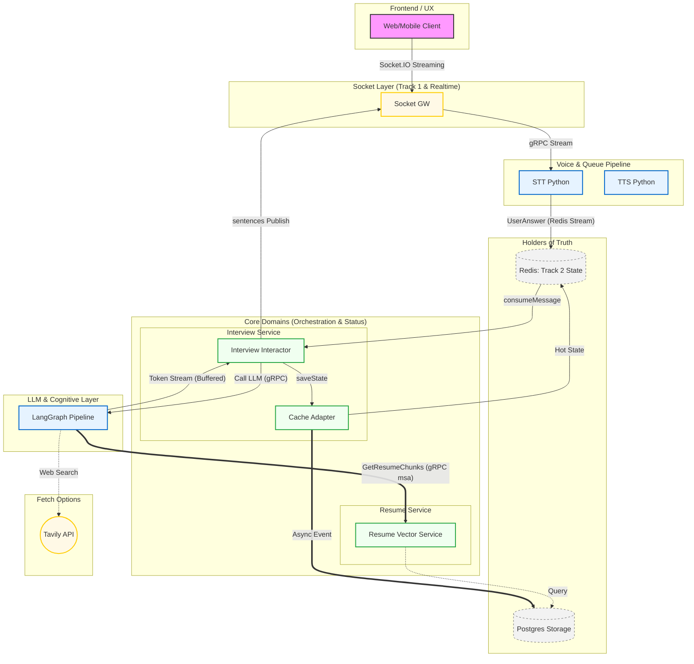
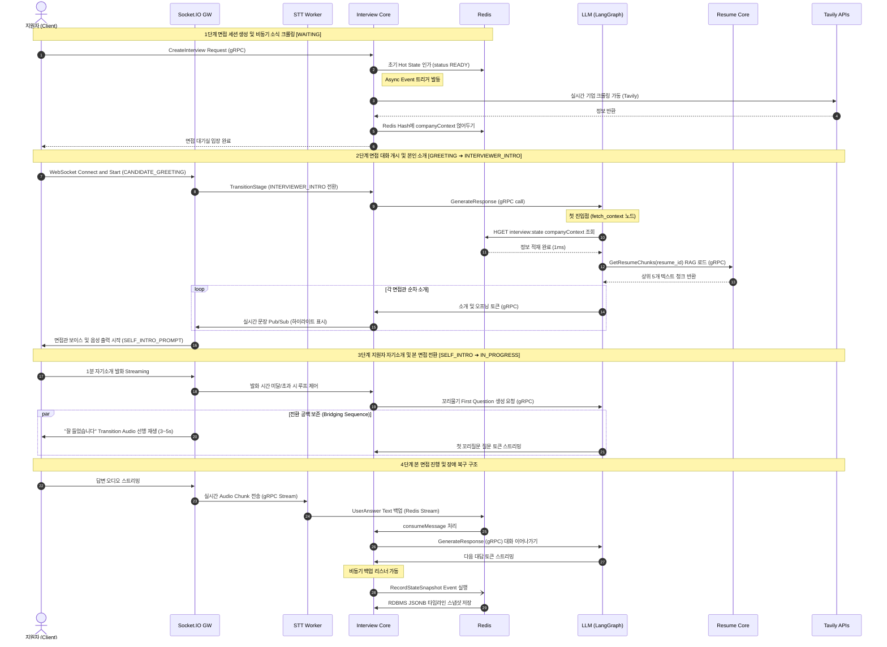

# AI 면접 시스템 아키텍처 및 데이터 흐름 큰 그림 (Big Picture)

본 문서는 동적 AI 에이전트 설계 및 완벽한 MSA(Microservices Architecture) 데이터 격리 원칙, 비동기 장애 복구 시스템을 목표로 구현된 전체 아키텍처 개요입니다.

---

## 🏛️ 서비스 계층 구조 (Layer Roles)

전체 시스템은 **Socket(소통), Core(통제), LLM(사고), Workers(오디오 체인)** 네 가지 핵심 계층으로 유기적으로 연결되어 있습니다.

### 1. Socket Server (Node/NestJS)

- **역할**: 프론트엔드와 WebRTC 및 Socket.IO 실시간 양방향 연결 유지
- **특징**: 1차 방어벽으로 사용자 발화 이중 Drop을 검증하고, 음성 버퍼(Streaming) 중계를 실시간으로 처리합니다. (Track 1 Pub/Sub)

### 2. Core Server (Java/Spring Boot - 멀티 모듈)

- 면접 세션의 핵심 비즈니스 로직과 흐름을 정형화하는 오케스트레이터입니다.
  - **Resume (이력서)**: 사용자가 업로드한 이력서 CSV/PDF 등 고유 데이터를 관리하며, Postgres의 `vector_store` RAG 파트를 오너십(Ownership)으로 보유합니다.
  - **Interview (인터뷰)**: 면접 개시, 진행 상태 전이(State Machine), 턴 수 관리 및 상태 백업 로깅을 수행합니다.

### 3. LLM Service (Python/FastAPI - LangGraph)

- **역할**: 면접 진행의 "두뇌" 역할을 수행하며 단일 프롬프트가 아닌 **에이전트 워크플로우** 형태로 동작합니다.
- **Context Fetch 노드**: 면접관 에이전트가 주도적으로 외부 context(Tavily 크롤링) 검색 및 이력서(Resume gRPC Call) 조각을 당겨와 사유(Thinking)를 고도화합니다.

---

## 📊 데이터 흐름 (Data Flow Diagram)



---

## 💡 최근 추가된 핵심 아키텍처 디자인 의사결정 (Core Decisions)

| 피처 하이라이트                    | 구현 형태                                                                                                                                                        | 핵심 이점 (Benefit)                                                                                                  |
| :--------------------------------- | :--------------------------------------------------------------------------------------------------------------------------------------------------------------- | :------------------------------------------------------------------------------------------------------------------- |
| **💡 RDBMS JSONB 비동기 백업**     | Java Core의 `ApplicationEvent` + `@Async`리스너 조합 활용 (백그라운드 INSERT)                                                                                    | Redis 단독 장애 시에도 면접 종료 전까지의 난이도, 순번 등 **타임라인 전체 복원성 확보**. 지연시간 0ms                |
| **🧠 완벽한 MSA 기반 RAG 체널링**  | Python LLM (Client) ➡️ [Resume](file:///Users/shin-yoonsik/Desktop/ai-interview-project/services/proto/resume/v1/resume.proto#19-21) (gRPC Server) API 호출 구조 | 에이전트의 **자율적 Context 탐색권**을 유지하면서도 남의 DB에 direct connection 하지 않는 **MSA 데이터 무결성 보존** |
| **🌍 실시간 기업 트렌드 (Tavily)** | 면접관 세션 개시 시 동적으로 회사 최근 동향/직무 스택 최신 크롤링 병렬 수집                                                                                      | 뻔한 GPT 응답에서 탈피하고 AI 면접관에게 소속감을 주입하여 현실적 꼬리 질문을 던지는 **극사실주의 면접관 구축**      |
| **🛡️ 롤링 윈도우 메모리**          | Python LangGraph 인프라 내에 15턴 초과 시 `RemoveMessage` 요약 치환 장치 마련                                                                                    | 인터뷰가 길어져 발생하는 **토큰 한도 오버플로우(`OutOfMemory`) 에러 원천 봉쇄**                                      |

---

## 🕒 상세 면접 세션 국면 (Opening & Closing Stage Flow)

AI 면접관의 순차적 발화와 지원자 답변이 유기적으로 전파(State Transition)되는 물리적 마일스톤입니다.

```text
[ WAITING ] ➔ [ GREETING ] ➔ [ CANDIDATE_GREETING ] ➔ [ INTERVIEWER_INTRO ] ➔ [ SELF_INTRO_PROMPT ] ➔ [ SELF_INTRO ] ➔ [ IN_PROGRESS ] ➔ [ LAST_QUESTION_PROMPT ] ➔ [ LAST_ANSWER ] ➔ [ CLOSING_GREETING ] ➔ [ COMPLETED ]
```

### 1. 주요 순서 궤도 (High-Level Sequence)

- **오프닝 연출**: `GREETING` (면접관 환영) ➡️ `CANDIDATE_GREETING` (가벼운 인사) ➡️ `INTERVIEWER_INTRO` (순차적 자기소개)
- **자기소개 진행**: `SELF_INTRO_PROMPT` ➡️ 지원자 시간 지연 루프(`SELF_INTRO`) ➡️ **IN_PROGRESS** (본격 질의응답)
- **마감 연출**: `LAST_QUESTION_PROMPT` (마지막 발언 유도) ➡️ `CLOSING_GREETING` (상호 작별인사) ➡️ `COMPLETED` (최종 종료)

---

## 🔄 전체 라이프사이클 통합 시퀀스 (Full Lifecycle Sequence)

이 섹션은 면접이 처음 **생성(Created)될 때부터**, 대화가 순차적으로 시작되고 지원자의 답변이 처리되어 백업되는 **모두 유기적 연쇄 과정**을 요약합니다.

### 🧩 컴포넌트별 실행 원칙 (Execution Model)

1.  **🌱 Core Orchestrator**: 면접의 상태(`turnCount`, `stage`) 조율 및 에이전트(LLM) 통제
2.  **🧠 Python Agent(LangGraph)**: 자율 데이터 노드 탐색(`Tavily`, `Resume gRPC`)과 `RedisSaver`를 이용한 메모리 격리
3.  **🔊 Streaming Worker**: 오디오 중계와 텍스트 분기는 **비동기 Redis Stream**을 타도록 격리되어 있습니다.

---

### 📊 전체 데이터 통합 시퀀스 다이어그램 (Timeline Breakdown)


