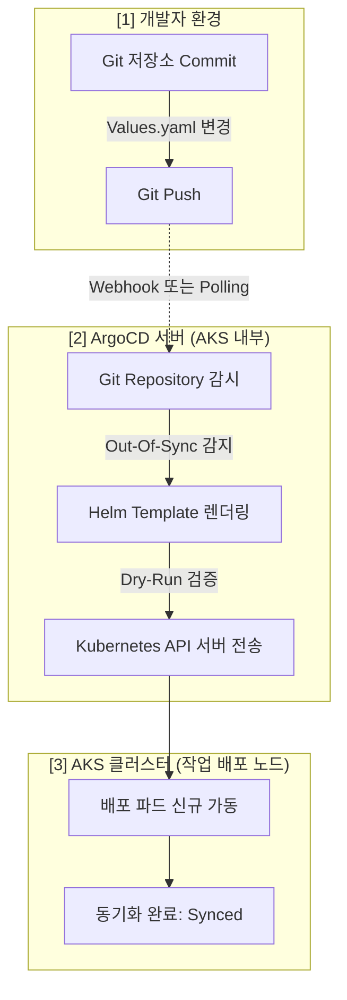

# ⚓ Helm & ArgoCD 통합 기본 가이드 (GitOps 아키텍처)

본 문서는 사내 AKS 클러스터에 배포되는 모든 마이크로서비스와 인프라의 템플릿화를 담당하는 **Helm** 및 이를 지속 배포(CD) 동기화하는 **ArgoCD**의 기술 매커니즘 및 본 프로젝트 적용 사양을 기술합니다.

---

## 1. 📦 Helm (Kubernetes 패키지 매니저)

### 💡 기본 개념

- **정의**: Kubernetes 리소스(Deployment, Service 등)를 **템플릿화**하여 관리하는 패키징 도구입니다.
- **핵심 구성품**:
  - **`Chart.yaml`**: 차트의 이름, 버전, 의존성(Dependencies)을 선언하는 메타데이터 파일.
  - **`values.yaml`**: 템플릿에 주입할 변수(값)를 정의하는 설정 파일 (예: 레플리카 수, 도커 이미지 태그).
  - **`templates/`**: `{{ .Values.key }}` 와 같은 Go 템플릿 문법으로 작성된 실제 K8s 매니페스트 세트.

### 🚀 본 프로젝트 적용 아키텍처

본 프로젝트는 **Helm의 두 가지 설계 패턴**인 Generic 패턴과 Umbrella 패턴을 혼용합니다.

#### ① Generic-App 패턴 (공통 배포 본체)

- **위치**: `k8s/charts/generic-app/`
- **방식**: `auth`, `interview`, `payment` 등 개별 앱이 배포 YAML을 각자 복사/생성하지 않고, **단 하나의 공통 Deployment 템플릿**을 공유합니다.
- **장점**: 프롭(Live/Readiness) 주기 정밀 조율이나 보안 컨텍스트 조율 시 `generic-app` 템플릿 1곳만 수정하면 모든 서비스에 동시 적용됩니다.

#### ② Umbrella-Chart 패턴 (Redis 의존성 이식)

- **위치**: `k8s/apps/redis-track1 / track2`
- **방식**: 외부 헬름 레포인 `Bitnami Redis`를 Sub-Chart(의존성)로 선언하고, `values.yaml` 만 오버라이딩하여 배포합니다.
- **프로젝트 스펙 대비**:
  - **Track 1 (PubSub 전용)**: Sentinel Mode 연동 ➔ `persistence.enabled: false` (완전 인메모리).
  - **Track 2 (LLM 백업용)**: 장애 로깅 복구 ➔ `appendonly: yes` 및 8Gi PVC 탑재.

---

## 2. ⚓ ArgoCD (GitOps 기반 연속 배포 빌더)

### 💡 기본 개념

- **정의**: Git 저장소에 선언된 매니페스트(Desired State)와 실제 K8s 클러스터의 상태(Live State)를 감시하고, **차이(Out-Of-Sync)가 발생하면 자동 동기화**해주는 GitOps 도구입니다.
- **핵심 철학**: 클러스터에 직접 `kubectl apply`를 타건하지 마라. **모든 인프라 변경의 시작과 끝은 오직 Git Commit** 이어야 한다.

### 🚀 본 프로젝트 작동 메커니즘

ArgoCD는 K8s 클러스터 내부의 **`Application`** 이라는 커스텀 리소스(CRD) 단위로 배포를 트래킹합니다.

#### ArgoCD Application 리소스 모델 (구동 예시)

```yaml
apiVersion: argoproj.io/v1alpha1
kind: Application
metadata:
  name: auth-service-prod
  namespace: argocd
spec:
  project: default
  source:
    repoURL: "https://github.com/Yoonsik-Shin/ai-interview-project.git"
    targetRevision: main
    path: k8s/apps/auth/prod # 💡 싱킹할 로컬 경로
    helm:
      valueFiles:
        - values.yaml # generic-app 기본 사양 주입
  destination:
    server: "https://kubernetes.default.svc"
    namespace: interview
  syncPolicy:
    automated:
      prune: true # Git에서 삭제되면 K8s에서도 자동 삭제
      selfHeal: true # 누군가 K8s를 직접 수정하면 Git 상태로 원복
```

---

## 🔄 3. Helm ➔ ArgoCD 유기적 구동 플로우 (Mermaid)



### 🧠 왜 두 가지를 결합하는가?

1.  **배포 유연성 (Helm)**: 동적으로 포트 변환이나 스케일 아웃이 쉬워집니다.
2.  **보안성 및 이력 추적 (ArgoCD)**: 작업 권한 파편화를 소스 이력으로 단일화하고 클러스터 사고 다운타임을 `Rollback` 버튼 하나로 복원할 수 있습니다.
