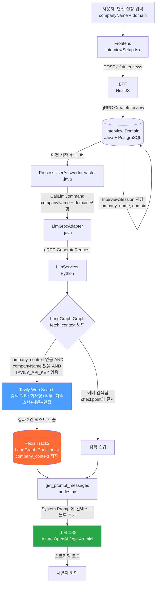
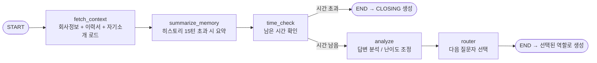

# 회사 정보 크롤링 (Company Context) 상세 분석

> 면접 설정에서 입력한 **회사명 + 직무**가 LLM 프롬프트까지 어떻게 흘러가는지,
> Tavily가 뭔지, 현재 무엇이 깨져 있는지를 정리한 문서.

---

## 1. Tavily가 뭔데?

**Tavily**는 AI 애플리케이션을 위해 특화된 **실시간 웹 검색 API**다.
일반 검색 엔진과 달리, 검색 결과에서 **LLM이 바로 쓸 수 있는 정제된 텍스트**만 추출해서 돌려준다.

```
일반 검색 (Google/Bing)         Tavily Search
┌─────────────────────┐         ┌─────────────────────┐
│ HTML + 광고 + 쿠키  │         │ 정제된 텍스트만      │
│ CSS + 스크립트...   │   vs    │ (LLM 바로 주입 가능) │
│ 불필요한 마크업     │         │ 관련도 높은 순으로   │
└─────────────────────┘         └─────────────────────┘
          ↓                               ↓
   파싱/전처리 필요               바로 프롬프트에 넣기 OK
```

**우리 서비스에서의 역할:**

- 면접 시작 시 `"{회사명} {직무} 기술 스택 채용 면접"` 쿼리로 웹 검색
- 결과 2건을 텍스트로 추출 → LLM System Prompt에 주입
- LLM이 해당 회사 맞춤 질문을 생성할 수 있게 됨

**API Key:** `TAVILY_API_KEY`

- 현재 prod/common ConfigMap에 **설정되어 있지 않음** → 크롤링 비활성화 상태
- [tavily.com](https://tavily.com) 에서 발급 (월 1,000건 무료)

---

## 2. 전체 데이터 흐름



---

## 3. 면접 진행 중 턴별 동작

```
첫 번째 턴 (면접 시작):
┌─────────────────────────────────────────────────────────┐
│  fetch_context 노드 실행                                  │
│                                                          │
│  1. company_context 체크 → Redis에 없음                   │
│  2. companyName = "카카오", TAVILY_API_KEY = "tvly-..."   │
│  3. Tavily 검색 실행                                      │
│     query: "카카오 프론트엔드 기술 스택 채용 면접"         │
│  4. 결과 텍스트 → company_context 업데이트               │
│  5. Redis Checkpoint에 저장 (thread_id = interview_id)    │
└─────────────────────────────────────────────────────────┘
                          ↓
두 번째 턴 ~ 마지막 턴:
┌─────────────────────────────────────────────────────────┐
│  fetch_context 노드 실행                                  │
│                                                          │
│  1. company_context 체크 → Redis에 이미 존재!             │
│  2. 검색 스킵 (비용/시간 절약)                            │
│  3. 기존 company_context 그대로 사용                      │
└─────────────────────────────────────────────────────────┘
```

---

## 4. LLM 프롬프트 조립 구조 (get_prompt_messages)

```
┌──────────────────────────────────────────────────────────────┐
│                     System Message                           │
├──────────────────────────────────────────────────────────────┤
│ [역할 프롬프트]                                               │
│   roles.yaml → TECH / HR / LEADER / CLOSING                  │
│                                                              │
│ [페르소나 프롬프트]                                           │
│   personalities.yaml → COMFORTABLE / PRESSURE                │
│   ⚠️ 현재 하드코딩으로 항상 COMFORTABLE                       │
│                                                              │
│ [공통 지시사항]                                               │
│   COMMON_INSTRUCTION: 한국어 사용, 지원자님 호칭 등          │
│                                                              │
│ [사전 컨텍스트 정보] ← 여기에 크롤링 결과 들어감             │
│   ├─ [기업 정보 검색 결과]                                    │
│   │   Tavily로 검색한 회사 정보 텍스트 (2건)                  │
│   ├─ [이력서 참고 정보]                                       │
│   │   Resume Service gRPC로 가져온 청크 (5개)                 │
│   └─ [지원자 자기소개]                                        │
│       Redis에서 가져온 자기소개 텍스트                        │
│                                                              │
│ [현재 단계 가이드]                                           │
│   stages.yaml → GREETING / SELF_INTRO / IN_PROGRESS 등       │
├──────────────────────────────────────────────────────────────┤
│                   대화 히스토리 (Messages)                    │
│   HumanMessage / AIMessage (LangGraph Checkpoint)            │
├──────────────────────────────────────────────────────────────┤
│                   현재 사용자 입력                            │
│   HumanMessage(content=user_text)                            │
└──────────────────────────────────────────────────────────────┘
```

---

## 5. LangGraph 그래프 노드 순서



---

## 6. 현재 발견된 문제점

### 6-1. TAVILY_API_KEY 미설정 → 크롤링 완전 비활성화

```
k8s/apps/llm/common/configmap.yaml  ← TAVILY_API_KEY 없음
k8s/apps/llm/prod/configmap.yaml    ← TAVILY_API_KEY 없음
```

```python
# config.py:70
TAVILY_API_KEY = _env("TAVILY_API_KEY", "")  # 빈 문자열 = 비활성화

# nodes.py:55
if TAVILY_API_KEY:     # False → 검색 실행 안 됨
    tool = TavilySearchResults(...)
```

**결과:** 회사명을 입력해도 회사 정보 없이 일반 면접 질문만 생성됨.

---

### 6-2. personality 설정이 LLM에 전달 안 됨

```python
# grpc_handler.py:51
personality = "COMFORTABLE"   # ← 사용자 선택값 무시, 하드코딩
```

```
사용자가 PRESSURE 선택 → Java에서 gRPC로 전달 안 함
                                     ↓
                       Python에서 항상 COMFORTABLE로 고정
```

프론트엔드에서 면접 강도를 설정해도 실제 LLM 동작에 반영이 안 되고 있음.

---

### 6-3. 실패 시 조용히 넘어감 (Silent Failure)

```python
# nodes.py:61-63
except Exception as e:
    print(f"Failed to fetch company context: {e}")
    updates["company_context"] = "검색 실패"   # ← 에러인지 모름
```

```python
# nodes.py:291-292 (get_prompt_messages)
if comp_ctx and comp_ctx != "검색 실패":   # "검색 실패"는 걸러냄
    context_block += f"\n{comp_ctx}"
```

API 키가 없거나 Tavily 서버 장애가 나도 면접은 계속 진행됨.
로그에만 `print`로 남고 모니터링/알림 없음.

---

### 6-4. 검색 쿼리가 한국어 고정

```python
query = f"{company} {domain} 기술 스택 채용 면접"
```

```
예시:
  "카카오 프론트엔드 기술 스택 채용 면접"       → OK
  "Google 프론트엔드 기술 스택 채용 면접"       → 결과 부실할 수 있음
  "Meta 백엔드 기술 스택 채용 면접"             → 결과 부실할 수 있음
```

글로벌 기업 이름 + 한국어 키워드 조합이면 관련 결과가 안 나올 수 있음.

---

## 7. 조건 분기 총정리

```
companyName 입력됨?
        │
       Yes ──────────────────────────────── No
        │                                    │
TAVILY_API_KEY 있음?              회사 컨텍스트 없이 진행
        │
       Yes ──────── No
        │            │
   검색 실행   검색 스킵 (컨텍스트 없음)
        │
   성공? ─── No → "검색 실패" 저장 → 컨텍스트 없이 진행
        │
       Yes
        │
  company_context에 저장
  (Redis Checkpoint, 면접 내내 유지)
        │
  System Prompt에 주입
```

---

## 8. 현재 상태 요약

| 기능                          | 상태          | 원인                     |
| ----------------------------- | ------------- | ------------------------ |
| Tavily 크롤링 코드            | ✅ 구현됨     | -                        |
| 실제 크롤링 동작              | ❌ 비활성화   | TAVILY_API_KEY 미설정    |
| 크롤링 결과 → 프롬프트 주입   | ✅ 구현됨     | -                        |
| 최초 1회만 검색 (성능 최적화) | ✅ 동작       | Redis Checkpoint 활용    |
| personality 반영              | ❌ 동작 안 함 | grpc_handler.py 하드코딩 |
| 크롤링 실패 감지              | ⚠️ 미흡       | print 로그만, 알림 없음  |
| 글로벌 기업 검색              | ⚠️ 불안정     | 한국어 쿼리 고정         |

---

## 9. 크롤링 활성화하려면

**Step 1.** Tavily API Key 발급 (무료)

```
https://app.tavily.com → Sign up → API Keys
```

**Step 2.** k8s Secret에 추가

```yaml
# k8s/apps/llm/prod/secret.yaml (신규 생성 필요)
apiVersion: v1
kind: Secret
metadata:
  name: llm-secret
  namespace: unbrdn
type: Opaque
stringData:
  TAVILY_API_KEY: "tvly-xxxxxxxxxxxxxxxxxxxxxxxx"
```

**Step 3.** LLM Deployment에서 Secret 참조

```yaml
env:
  - name: TAVILY_API_KEY
    valueFrom:
      secretKeyRef:
        name: llm-secret
        key: TAVILY_API_KEY
```
