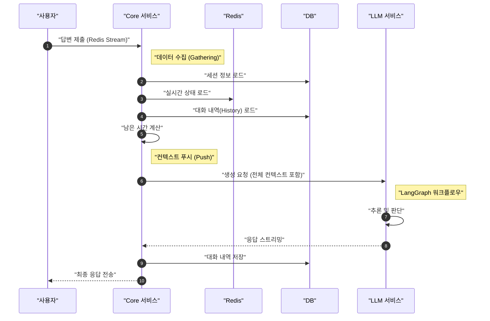
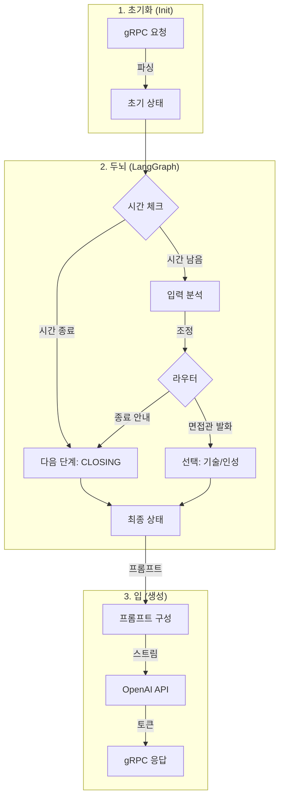
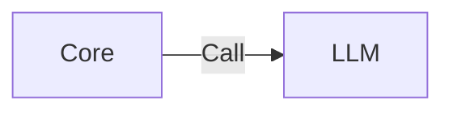
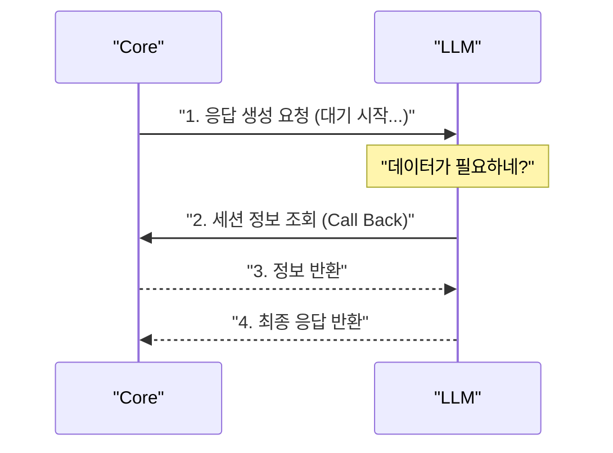
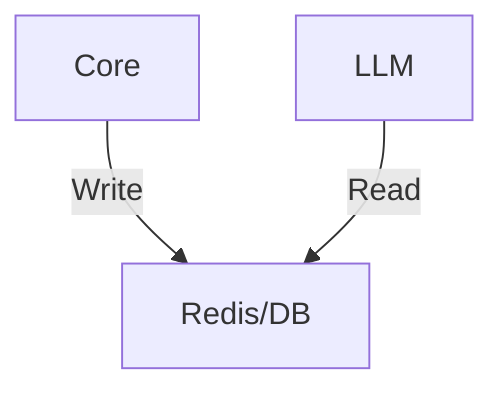
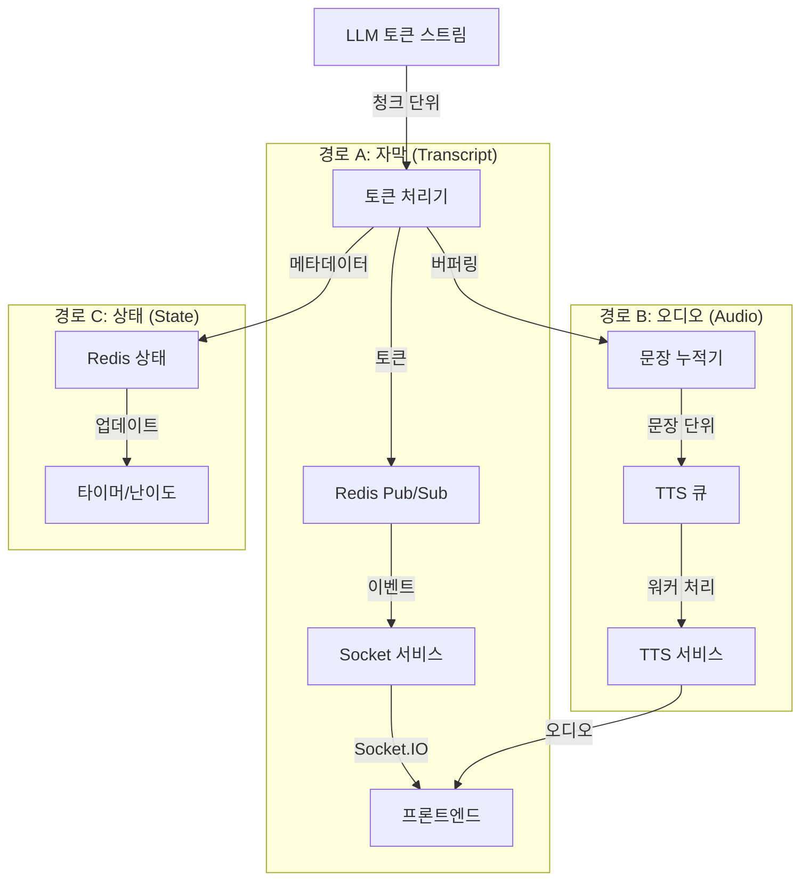
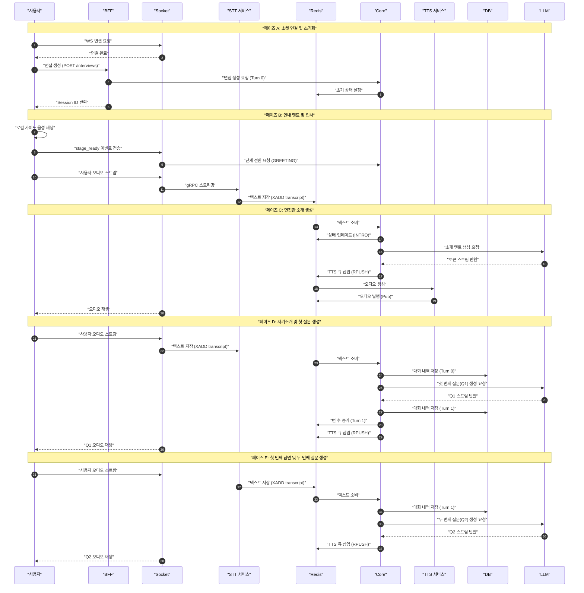

# Current Architecture Deep Dive (As-Is)

이 문서는 아키텍처 리팩토링을 위해 현재 시스템의 **데이터 흐름, 컴포넌트 역할, 그리고 제약 사항**을 아주 상세하게 분석한 자료입니다.

## 1. 시스템 개요 (System Overview)

현재 시스템은 **Core Monolith**가 모든 상태와 로직을 통제하고, **LLM Service**는 Core가 떠먹여주는 데이터(Context)를 받아 텍스트만 생성하는 **Stateless Worker** 구조입니다.

### 1.1 핵심 컴포넌트

| 서비스     | 역할 (Role)               | 주요 데이터 소유권 (Data Ownership)                       |
| :--------- | :------------------------ | :-------------------------------------------------------- |
| **BFF**    | Gateway, Auth             | User Session (JWT)                                        |
| **Core**   | **Brain (Control Tower)** | **Interview Session (DB/Redis), History (DB), User (DB)** |
| **Socket** | Realtime Pipe             | A/V Stream State                                          |
| **LLM**    | **Stateless Function**    | 없음 (요청 받을 때만 데이터 가짐)                         |
| **Redis**  | Shared State/Bus          | `interview:{id}:state` (Time, Stage), Pub/Sub, Streams    |

---

## 2. 데이터 흐름 분석 (Data Flow Analysis)

사용자가 답변을 했을 때의 흐름입니다. **Core가 모든 데이터를 긁어모아서(Gathering) LLM에게 밀어넣는(Push)** 구조를 주목해주세요.

### 2.1 아스키 아트: The "Push" Flow

```text
       [ User ]
          │ (1) User Answer Audio/Text
          ▼
    [ Socket/STT ]
          │ (2) Transcribed Text (Redis Stream)
          ▼
+---------------------------------------------------------------+
|                      Core Service (Brain)                     |
|                                                               |
| 1. [Session Load] DB에서 면접 세션 정보 조회 (JPA)              |
| 2. [State Sync] Redis에서 실시간 시간/일시정지 상태 조회          |
|    -> "지금 120초 지났고, 30초 남았음" 계산                      |
| 3. [History Load] DB에서 이전 대화 내역 전체 조회                |
| 4. [Construct Request] 이 모든 데이터를 하나의 gRPC 요청으로 포장  |
|    -> { session_info, time, history[], user_text }            |
+---------------------------------------------------------------+
          │
          │ (3) gRPC Call (Huge Context Payload)
          ▼
+---------------------------------------------------------------+
|                       LLM Service                             |
|                                                               |
| 1. [Stateless] 요청 패킷 해체                                  |
| 2. [LangGraph] 그래프 실행 (받은 시간/상태로만 판단)              |
| 3. [Generate] 다음 질문 생성                                   |
| 4. [Forget] 메모리 해제 (저장 안 함)                            |
+---------------------------------------------------------------+
          │
          │ (4) Response Stream
          ▼
       [ User ]
```

### 2.2 시퀀스 다이어그램 (Sequence Diagram)



---

## 3. 상세 구현 분석 (Code Level)

### 3.1 Core Service (`ProcessUserAnswerInteractor.java`)

이 클래스가 사실상 **"오케스트레이터"** 역할을 수행합니다.

1.  **Repository 조회**: `interviewPort.loadById()`, `conversationHistoryPort.loadHistory()`를 순차적으로 호출합니다.
2.  **Redis 동기화**: `sessionStatePort.getState()`를 호출하여 DB의 정적인 데이터(시작 시간)와 Redis의 동적인 데이터(일시정지 누적 시간)를 합칩니다.
3.  **gRPC 매핑**: 조회한 모든 엔티티를 `CallLlmCommand` DTO로 변환하여 LLM 클라이언트에 넘깁니다.

### 3.2 LLM Service Implementation Detail (`services/llm`)

LLM 서비스는 **"전략 수립(Strategy)"과 "실행(Execution)"이 분리**된 흥미로운 구조를 가지고 있습니다.

#### A. 내부 파이프라인 (Internal Pipeline)



1.  **State Construction (`grpc_handler.py`)**:
    - Core에서 받은 `request`를 Python Dictionary인 `InterviewState`로 변환합니다.
    - LangChain `BaseMessage` 객체들로 `history`를 재조립합니다.

2.  **Decision Making (`engine/graph.py`)**:
    - **Node 1: `time_check`**: 남은 시간(`remaining_time`)을 확인하여 강제 종료 여부를 결정합니다.
    - **Node 2: `analyze`**: 사용자 답변을 분석하여 난이도(`next_difficulty`)를 조절할지 결정합니다.
    - **Node 3: `router`**: 다음 발화자(`next_speaker_id`)를 결정합니다. (e.g., Tech Interviewer vs HR)

3.  **Generation (`grpc_handler.py`)**:
    - 그래프가 내린 결정(`final_state`)을 바탕으로 프롬프트를 완성합니다.
    - `llm.stream()`을 통해 실제 텍스트를 생성하고 Core로 스트리밍합니다.

#### B. 주요 코드 구조

- `engine/graph.py`: 의사결정 흐름도 (Workflow) 정의
- `engine/nodes.py`: 각 단계별 로직 (시간 체크, 난이도 분석, 라우팅)
- `service/grpc_handler.py`: 입출력 처리 및 최종 실행기

---

## 4. 아키텍처 리팩토링 및 제약 사항

### 4.1 순환 참조 (Circular Dependency) 문제란?

"LLM이 Core를 호출하는 게 왜 문제인가요?"에 대한 답변입니다.

**현재 (Push):** `Core -> LLM` (단방향)



**제안 (Pull):** `Core -> LLM -> Core` (양방향/순환)



**발생하는 문제점:**

1.  **Runtime Coupling (런타임 결합)**: Core가 LLM을 호출하고 응답을 기다리는(Blocking) 중에, LLM이 다시 Core를 호출합니다. 만약 Core의 Thread Pool이 꽉 차있다면 **Deadlock**이 걸릴 수 있습니다.
2.  **Deployment Coupling (배포 결합)**: Core API 스펙이 바뀌면 LLM도 고쳐야 하고, LLM 로직이 바뀌면 Core 데이터 제공 방식도 맞춰야 할 수 있습니다. 서로가 서로를 모르는 것이 가장 좋습니다.
3.  **Latency**: `Core -> LLM` (1 hop) vs `Core -> LLM -> Core` (2 hops + α). 네트워크 왕복이 늘어납니다.

### 4.2 해결 방안 (To-Be)

순환 참조를 끊으려면 **"제 3의 데이터 저장소"**가 필요합니다.



- Core는 데이터를 쓰기만 하고(Write), LLM은 읽기만 합니다(Read).
- 서로 직접 호출하지 않으므로 순환 참조가 사라집니다. (단, 데이터 스키마 공유 문제는 남음)

---

## 5. 결함 허용 및 복구 분석 (Fault Tolerance & Recovery)

사용자 트래픽 소실 방지 및 자동 복구 메커니즘에 대한 분석입니다.

### 5.1 데이터 안정성 (Data Safety) : ✅ 우수

사용자의 발화(User Input)는 LLM 호출 **이전에** 이미 영구 저장소에 격리됩니다.

- **Step 1**: Redis Stream(`stt:transcript`)에 저장 (Persistence)
- **Step 2**: Core가 Stream Consume 후 DB(`conversation_history`)에 저장
- **Step 3**: LLM 호출 시작

따라서, **LLM 서버가 폭발해도 사용자의 발화 데이터는 절대 사라지지 않습니다.**

### 5.2 프로세스 자동 복구 (Auto Recovery) : ⚠️ 부분적 존재

`LlmGrpcAdapter.java` 코드 분석 결과, **gRPC 레벨의 재시도 로직**이 구현되어 있습니다.

```java
// LlmGrpcAdapter.java 내부 로직 요약
if (error && retryCount < 3) {
    long backoff = 1000 * (2 ^ retryCount); // 지수 백오프 (1s, 2s, 4s)
    sleep(backoff);
    retry(); // LLM 재호출
}
```

- **방어 가능 범위**: 일시적인 네트워크 패킷 손실, LLM 파드 재시작 중의 짧은 다운타임.
- **방어 불가능 범위**:
  - 3회 이상 실패 시 (약 7초 후) 최종적으로 Error를 뱉고 종료됩니다.
  - 이 경우 프론트엔드는 응답을 받지 못하고 멈춰있게 됩니다. (새로고침 필요)

### 5.3 개선 권장 사항

1.  **Dead Letter Queue (DLQ)**: 3회 실패한 요청을 별도 큐(Redis/Kafka)에 저장하고, 워커가 나중에 조용히 재처리하여 알림을 보낼 수 있습니다.
2.  **Circuit Breaker**: LLM 장애가 지속될 경우, 빠르게 실패 처리하고 "잠시 후 다시 시도해주세요" 안내를 내보내야 합니다.

---

## 6. 응답 처리 및 스트리밍 상세 분석 (Response Streaming Flow)

LLM이 생성한 텍스트가 어떻게 사용자에게 도달하는지에 대한 상세 흐름입니다. **"텍스트 자막"과 "TTS 오디오"가 병렬로 처리**되는 것이 핵심입니다.

### 6.1 스트리밍 파이프라인 (The Dual-Path Flow)



### 6.2 주요 처리 로직 (`ProcessLlmTokenInteractor.java`)

1.  **Token Accumulation (문장 버퍼링)**:
    - TTS는 문장 단위로 생성해야 자연스럽기 때문에, `TokenAccumulator`가 토큰을 모읍니다.
    - `isSentenceEnd=true` 플래그가 오면 즉시 TTS 큐로 보냅니다.
2.  **Real-time Caption (실시간 자막)**:
    - 버퍼링 없이 **토큰이 오자마자 Redis Pub/Sub을 쏩니다.**
    - 덕분에 사용자는 오디오가 생성되기 전부터 텍스트가 타이핑되는 것을 볼 수 있습니다. (Latency 체감 감소)

3.  **Adaptive State Sync (적응형 상태 동기화)**:
    - LLM이 응답 생성 중에 "시간을 줄여야겠다"거나 "난이도를 올려야겠다"고 판단하면, 메타데이터를 함께 보냅니다.
    - Interactor는 이를 감지하고 즉시 **Redis Session State를 업데이트**하여, 다음 턴에 반영되도록 합니다.

---

## 7. 주요 시나리오 분석: 면접 시작부터 두 번째 턴까지 (End-to-End Scenario)

이 섹션은 사용자가 면접을 시작하는 순간부터 두 번째 질문/답변이 오갈 때까지의 **전체 데이터 흐름**을 다룹니다. **Socket Service**, **BFF**, **Redis Streams**가 어떻게 유기적으로 연결되는지 보여줍니다.

### 7.1 핵심 아키텍처 패턴

1.  **BFF (Backend For Frontend)**: HTTP 요청(면접 시작 등)의 진입점 역할을 하며, Core 서비스의 gRPC를 호출합니다.
2.  **Redis Streams (Event Bus)**: 사용자의 음성/텍스트 데이터는 **STT Service**에서 처리된 후 **Redis Stream**(`stt:transcript`)을 통해 Core로 전달되는 비동기 구조입니다.
3.  **Redis 우선 상태 관리 (Redis-First)**: Core Service는 DB를 조회하기 전에 항상 **Redis**(`interview:{id}:state`)를 먼저 찔러서 현재 상태와 턴을 확인합니다.

### 7.2 상세 시퀀스 다이어그램 (Detailed Data & Server Sequence)

**Socket 연결**부터 **2차 면접 질문 생성**까지의 흐름을 상세한 데이터 페이로드와 함께 나타냅니다.



### 7.3 단계별 상세 설명 (Phase Breakdown)

#### 1. Phase A (Setup)

- **동작**: 사용자가 **BFF**를 통해 `POST /interviews`를 호출합니다 (혹은 로비에서 진입).
- **결과**: Core가 DB에 `InterviewSession`을 생성하고, **Redis State**를 `WAITING`으로 초기화합니다. Socket 연결 후 클라이언트는 준비 이벤트를 기다리거나 보냅니다.

#### 2. Phase B (Guide & Greeting)

- **클라이언트 주도**: Core가 오디오 URL을 Push하는 것이 아니라, 클라이언트가 먼저 안내 멘트(Guide)를 재생하고 `interview:stage_ready`를 보냅니다.
- **상태 동기화**: Socket의 `SyncStageUseCase`가 Core gRPC를 호출하여 상태를 `CANDIDATE_GREETING`으로 변경합니다.
- **오디오 처리**: 사용자가 "안녕하세요"라고 말하면, **STT Service**가 이를 **Redis Stream (`stt:transcript:stream`)**에 기록(`XADD`)하고, Core가 이를 소비합니다.

#### 3. Phase C (Interviewer Intro - Dynamic)

- **LLM 생성**: 사용자의 인사가 확인되면 Core는 `INTERVIEWER_INTRO` 단계로 전환하고, LLM에게 **면접관 페르소나로 자기소개를 생성하라**고 요청합니다. (정적 파일 아님)
- **TTS 파이프라인**:
  1. Core가 LLM 텍스트를 문장 단위로 모아 **Redis List (`tts:sentence:queue`)**에 넣습니다.
  2. **TTS Service**가 이를 꺼내 오디오 파일을 생성하고 **Redis Pub/Sub (`interview:audio:{id}`)**에 발행합니다.
  3. Socket이 이를 받아 클라이언트(`interview:audio`)에 전송합니다.

#### 4. Phase D (Self-Intro & First LLM Call)

- **저장**: Core는 사용자의 자기소개를 DB에 저장합니다.
- **LLM 호출**: "면접관 소개" + "사용자 자기소개" 문맥을 합쳐서 첫 번째 기술 질문(Q1)을 생성합니다.

#### 5. Phase E (Turn 1 & Q2)

- **상태 변경**: 질문이 생성되면 Redis `Turn Count`가 1로 증가합니다.
- **누적 컨텍스트**: Core는 **"소개 + 자기소개 + Q1 + A1"** 전체를 LLM에 보내어, 이전 대화 맥락을 완벽히 이해한 상태에서 두 번째 질문(Q2)을 생성하도록 합니다.
