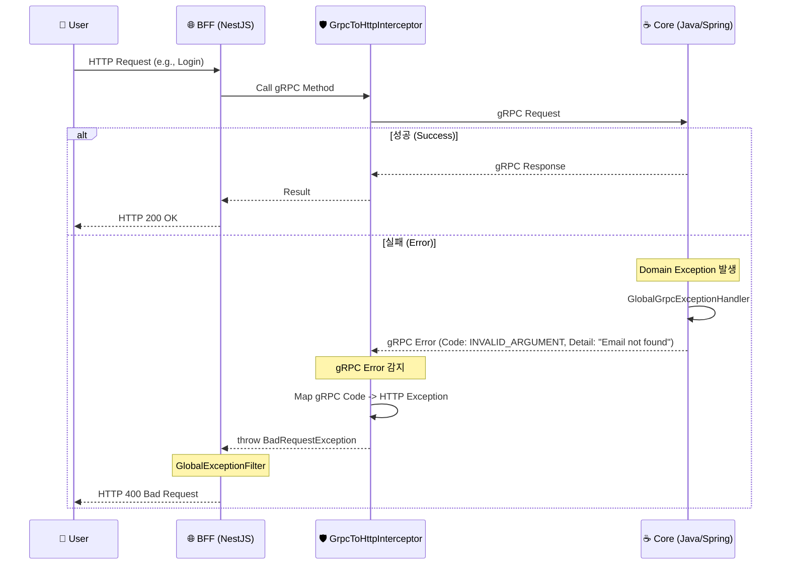

# Error Handling Architecture

BFF(Node.js)와 Core(Java) 간의 에러 처리는 **"gRPC Status Code 기반의 자동 변환"** 패턴을 따릅니다.
각 계층이 자신의 역할에 맞는 에러 처리를 수행하며, 최종적으로 클라이언트에게는 표준 HTTP 에러가 전달됩니다.

## 1. Overall Flow (사용자 요청 흐름)



---

## 2. Detailed Components (상세 컴포넌트)

### A. Core Service (Java/Spring Boot)

**역할**: 도메인 로직에서 발생한 순수 Java 예외를 gRPC 표준 에러로 변환하여 송출합니다.

1.  **Domain Logic**: 비즈니스 로직 수행 중 예외 발생
    ```java
    throw new IllegalArgumentException("존재하지 않는 이메일입니다.");
    ```
2.  **`GlobalGrpcExceptionHandler` (Interceptor)**:
    - 모든 gRPC 호출을 감싸고 있는 전역 예외 처리기입니다.
    - Java Exception을 잡아서 적절한 `io.grpc.Status`로 변환합니다.
    - **Mapping Rules**:
      - `IllegalArgumentException` → `Status.INVALID_ARGUMENT`
      - `EntityNotFoundException` → `Status.NOT_FOUND`
      - `SecurityException` → `Status.PERMISSION_DENIED`
      - (Others) → `Status.INTERNAL`

### B. BFF Service (Node.js/NestJS)

**역할**: gRPC 에러를 잡아서 프론트엔드가 이해할 수 있는 HTTP 에러로 변환합니다.

1.  **`GrpcToHttpInterceptor` (Custom Implementation)**:
    - **위치**: `src/core/interceptors/grpc-to-http.interceptor.ts`
    - **동작**: gRPC 클라이언트 호출을 감시(`intercept`)하다가 에러가 발생하면 가로챕니다.
    - **자동 변환**: `grpc-js`의 에러 객체(`code`, `details`)를 확인하고, **Switch Case**를 통해 NestJS의 `HttpException`으로 `throw`합니다.
      - `Status.INVALID_ARGUMENT(3)` → `BadRequestException (400)`
      - `Status.NOT_FOUND(5)` → `NotFoundException (404)`
      - `Status.UNAUTHENTICATED(16)` → `UnauthorizedException (401)`

2.  **`GlobalExceptionFilter`**:
    - **위치**: `src/core/filters/global-exception.filter.ts`
    - **참고**: 더 이상 복잡한 gRPC 매핑 로직을 가지지 않습니다. Interceptor가 이미 표준 HTTP 예외로 변환했기 때문입니다.
    - 최종적으로 HTTP 응답 포맷(JSON)을 맞추어 클라이언트에게 전송합니다.

## 3. Why this structure? (이 구조의 장점)

1.  **관심사의 분리**:
    - Core는 **도메인 문제**에만 집중하고, HTTP 상태 코드를 신경 쓰지 않습니다.
    - BFF는 **프로토콜 변환(gRPC -> HTTP)**에만 집중합니다.
2.  **자동화된 안정성**:
    - 개발자가 매번 `try-catch`로 에러를 잡아서 변환할 필요가 없습니다.
    - Interceptor가 전역에서 동작하므로, 새로운 API를 추가해도 에러 처리가 자동으로 적용됩니다.
3.  **표준 준수**:
    - Google의 [gRPC Error Handling 가이드](https://grpc.io/docs/guides/error/)와 HTTP Status Code 표준을 정확히 매핑하여 준수합니다.
