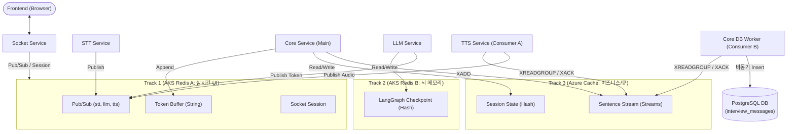
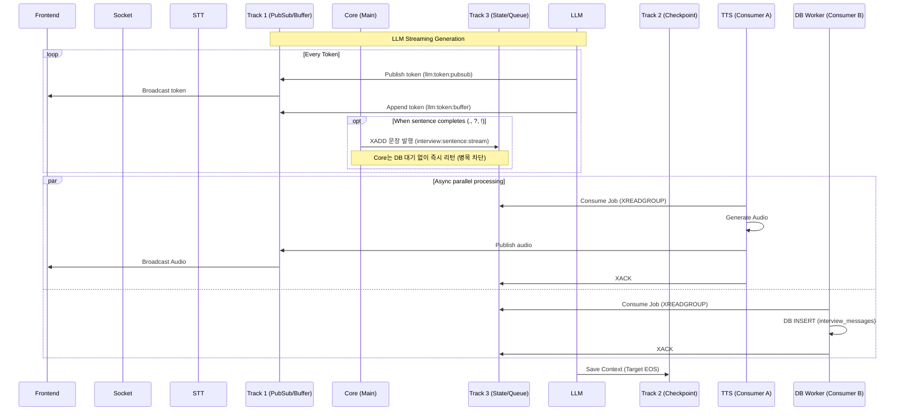

# Redis 3-Track 아키텍처: 현행 코드 vs 신규 설계 심층 비교

본 문서는 새롭게 정의된 **'Redis 3-Track 분산 설계'** 사상과 **현재 구현된 시스템 코드(Java/Python/DB 스키마)** 간의 필드 맵핑 및 인터뷰 전체 흐름상의 차이를 전수조사하여 분석합니다. 단순한 인프라 분리를 넘어 데이터 구조(자료구조)와 생명주기의 초고속 병렬 처리 변화를 포함합니다.

---

## 1. 인터뷰 전체 시퀀스 기반 흐름 비교

### ❌ As-Is (현재 로직 흐름)

1. **STT**: 발화 ➡️ `stt:transcript:stream` (단일 Redis)
2. **Core (수신)**: 해당 Stream을 Consume하여 `ProcessUserAnswerInteractor` 실행
3. **LLM 호출**: Core가 과거 이력을 모두 모아 LLM(gRPC) 호출
4. **LLM 생성 중**: 토큰을 Core로 반환 ➡️ Core 내 `TokenAccumulator` 메모리 버퍼 및 단일 Redis Cache에 임시 저장. 마침표 단위로 짤라서 `tts:sentence:queue`(List 형)에 `LPUSH`
5. **LLM 생성 종료 (`<EOS>`)**:
   - `TokenAccumulator`에 모인 `풀 텍스트(fullResponse)` 추출
   - DB `InterviewQnAJpaEntity`에 해당 턴의 질문/답변 쌍(Q&A Pair)을 **하나의 Row로 한 번에 INSERT/UPDATE**.
   - Redis 단일 `InterviewSessionState` (Hash) 갱신

> **문제점**: DB 쓰기가 완전히 끝날 때까지 턴이 넘어가지 않으며, 동기식(Synchronous) 트랜잭션이라 DB에 병목(수십~수백ms)이 발생하면 TTS 음성 생성도 덩달아 늦어집니다.

### ✅ To-Be (3-Track 신규 로직 흐름 및 DB 병목 격리)

1. **STT**: 발화 ➡️ Track 1 `stt:transcript:pubsub:{id}` (즉시 휘발, 0.1초 UI 업데이트)
2. **LLM (수신 & 컨텍스트 복원)**: Core는 세션 ID만 던짐 ➡️ LLM이 Track 2 (`llm:checkpoint:hash:{id}`)에서 과거 컨텍스트 복원 후 생성 시작
3. **LLM 생성 중 (스트리밍 파이프라인)**:
   - LLM ➡️ Core ➡️ Track 1 `llm:token:pubsub:{id}`로 토큰 단위 전송 (`{"type": "token", "content": "..."}`)
   - Track 1의 `llm:token:buffer:{id}` (String)에 토큰 `APPEND` (단어 조립 버퍼)
4. **문장 완성 시점 (병렬 컨슈머 다중화)**:
   - 마침표(`.`) 단위 문장 완성 시, Core는 DB 저장을 기다리지 않고 Track 3의 **`interview:sentence:stream` (Redis Streams)에 즉시 쏘고(`XADD`) 끝냅니다.**
   - 이 Stream에는 **2개의 독립적인 컨슈머 그룹**이 붙습니다:
     - **컨슈머 그룹 A (TTS 서버)**: 즉시 문장을 가져가 음성을 생성 (DB 장애나 지연과 완벽히 격리되어 초고속 반응).
     - **컨슈머 그룹 B (Core DB 워커)**: 느긋하게 문장을 가져가 비동기로 DB(`interview_messages` 테이블)에 INSERT 처리.
5. **LLM 생성 완료 (`<EOS>`)**:
   - 프론트에 `turn_complete` 통신 ➡️ 마이크 오픈
   - LLM 서버가 Track 2 (`llm:checkpoint:hash:{id}`) 해시 업데이트 완료.

### 📊 3-Track 아키텍처 구성도 및 시퀀스 다이어그램





---

## 2. 데이터베이스 (RDBMS) 구조 변화 (근본적 변경)

트래픽 병목 현상 및 트랜잭션 경합을 막고 데이터 유실을 방지하기 위해 **Q&A 중심 설계(단일 레코드)에서 채팅 로그 기반의 Append-Only 테이블 설계로 전면 변경**합니다.

### 🏆 최종 통합 스키마: `interview_messages` (메시지 중심 설계)

기존 `InterviewQnA`의 한계를 극복하고 LangGraph의 메시지 객체와 1:1 매핑이 가능한 구조입니다.

| 컬럼명                 | 타입 (JPA) | 설명 및 매핑 기준 (As-Is 대비 변경점)                                                                    |
| ---------------------- | ---------- | -------------------------------------------------------------------------------------------------------- |
| `id`                   | Long (PK)  | Auto Increment / UUID                                                                                    |
| `interview_session_id` | FK         | `InterviewSession` 테이블 참조                                                                           |
| `turn_count`           | Integer    | **[핵심]** 프론트엔드의 하나의 Q&A 묶음을 식별하는 그룹핑 키                                             |
| `sequence_number`      | Integer    | 한 턴, 같은 발화자 내에서의 문장 기록 순서                                                               |
| `role`                 | Enum       | **[추가됨]** `AI`(면접관), `USER`(지원자), `SYSTEM`. 기존 `questionText`/`answerText`를 역할로 완벽 분리 |
| `content`              | TEXT       | 완성된 한 문장 (기존 `sttText` 및 LLM 생성 문장)                                                         |
| `media_url`            | VARCHAR    | 해당 문장의 오디오(TTS 또는 STT 녹음본) S3/Blob 링크                                                     |
| `created_at`           | Timestamp  | 문장이 DB에 기록된 시간                                                                                  |

### 💡 아키텍처 변경의 3대 기대 효과

1. **DB Lock 및 데드락 원천 차단**
   - 과거에는 한 턴에서 유저 발화 시 `answerText` UPDATE, AI 발화 시 `questionText` UPDATE를 수행했습니다.
   - 새 방식은 채팅창처럼 문장이 완성될 때마다 **순수 INSERT**만 발생하므로 대규모 트래픽에도 트랜잭션 대기가 아예 사라집니다 (무경합성).
2. **LangGraph (Track 2) 상태와의 완벽한 1:1 동기화**
   - LangGraph의 내부 상태(`[{"role": "ai", "content": "..."}, {"role": "user", "..."]`)와 DB 테이블 구조가 일치합니다.
   - Track 2(Redis Checkpoint)가 장애로 날아가더라도 이 테이블만 조회하면 0.1초 만에 LLM의 문맥을 100% 복구할 수 있습니다.
3. **분석 데이터(analysisData)의 완벽한 분리 및 정규화**
   - 기존의 무거운 JSON 평가 데이터를 실시간 메시지 로그 테이블에서 과감히 제거합니다.
   - 면접 종료 후 `interview_turn_evaluations` 등의 별도 테이블로 분리하여 실시간 로그 쓰기 성능 최적화 및 DB 정규화를 동시에 달성합니다.

### 🚀 프론트엔드 데이터 조립(Read) 시나리오

면접 기록을 과거처럼 '질문-답변 쌍'으로 보여줘야 할 때는 백엔드 API에서 아래와 같이 `GROUP_CONCAT` (또는 Java Stream API)를 활용해 동적으로 조립하여 반환합니다.

```sql
-- 백엔드에서 면접 이력 조회 시 쿼리 예시
SELECT
    turn_count,
    role,
    GROUP_CONCAT(content ORDER BY sequence_number SEPARATOR ' ') AS full_text
FROM interview_messages
WHERE interview_session_id = 'int_123'
GROUP BY turn_count, role
ORDER BY turn_count ASC;
```

위 쿼리 한 줄로 쪼개져 저장된 스트리밍 청크들이 하나의 완전한 텍스트([1턴 AI 텍스트], [1턴 USER 텍스트])로 완벽하게 뭉쳐집니다.

---

## 3. Redis 키 & 자료구조 전수 분석 (네이밍 컨벤션 적용)

보편적인 인프라 원칙(`domain:resource:action:{id}`)을 엄격히 적용하여 Redis 키를 표준화합니다.

### 🛣️ Track 1: 초고속 신경망 (AKS 내부 Redis A) - I/O 최소화

| 역할 구분                    | As-Is 자료구조 및 필드 현황                                      | To-Be (표준 Naming & 규격)                                                                                                                                                                |
| ---------------------------- | ---------------------------------------------------------------- | ----------------------------------------------------------------------------------------------------------------------------------------------------------------------------------------- |
| **실시간 스트림 (STT, LLM)** | - `stt:transcript:stream` (Stream) <br>- `PublishTranscriptPort` | - **`interview:stt:pubsub:{interview_id}`** (Pub/Sub)<br> `{"type":"stt", "text":"..."}`<br>- **`interview:llm:pubsub:{interview_id}`** (Pub/Sub)<br> `{"type":"token", "content":"..."}` |
| **조립용 메모리 버퍼**       | - `TokenAccumulator.java` 내 `StringBuilder` 메모리              | - **`interview:llm:buffer:{interview_id}`** (String)<br>- `APPEND` 명령어로 텍스트 이어붙임<br>- 문장 분리/XADD 즉시 `DEL`                                                                |
| **WebSocket 세션**           | - Socket.io 내부 어댑터 임의 구조                                | - **`socket:connection:user:{user_id}`** (String)<br>- Socket ID 맵핑, TTL 3600 강제                                                                                                      |

### 🧠 Track 2: LLM 전용 뇌 (AKS 내부 Redis B) - LangGraph Checkpoint

이 트랙은 **오직 LLM 서비스만** 접근 권한을 갖으며, Core 서버 접근은 차단됩니다.

| 역할 구분            | As-Is 자료구조 및 필드 현황                   | To-Be (표준 Naming & 규격)                                                                                                                                                                             |
| -------------------- | --------------------------------------------- | ------------------------------------------------------------------------------------------------------------------------------------------------------------------------------------------------------ |
| **메모리(히스토리)** | - (Core/LLM 혼용)<br>- `langgraph:checkpoint` | - **`langgraph:checkpoint:hash:{session_id}`** (Hash)<br> - `"checkpoint_id" : "step_X"`<br> - `"channel_values" : { "messages": [...] }`<br>- 업데이트 조건: LLM 턴 생성 완료 시에만 `HSET` 덮어쓰기. |

> 💡 **심층 분석: LLM 스트리밍과 Checkpoint 업데이트 시점의 분리 (Eventual Consistency)**
>
> "DB에는 문장 단위로 계속 쪼개서 넣는데, LangGraph Checkpoint에는 언제 업데이트 될까?" 라는 의문이 생길 수 있습니다. 이는 프레임워크의 의도된 비동기 설계입니다.
>
> 1. **스트리밍 중 (실시간 배달)**: LLM이 토큰을 생성할 때마다 Track 1으로 쏘고, Core는 문장이 완성될 때마다 DB 워커에 던집니다. 이때 **Track 2의 Checkpoint는 절대 건드리지 않습니다.** (DB 성능 병목 방지)
> 2. **턴 종료 시 (내부 조립 완료)**: LangGraph는 뱉어낸 스트리밍 청크들을 내부 메모리에서 통짜 텍스트(`AIMessage`)로 조립해둡니다. 문장 생성이 완전히 끝나고(`<EOS>`) 그래프 노드 실행이 종료되는 딱 그 순간, Track 2 (Redis B)에 현재 턴의 **전체 대화 이력을 단 한 번 HSET** 합니다.
>
> 결론적으로, 스트리밍 처리(초고속 응답용)와 Checkpoint(문맥 보존용)가 완전히 독립적으로 동작하여 트래픽 간섭 없이 최고의 성능을 냅니다.

### 🏦 Track 3: 안전한 금고 (Azure Cache for Redis) - 비즈니스 워크로드

| 역할 구분             | As-Is 자료구조 및 필드 현황                                                 | To-Be (표준 Naming & 규격)                                                                                                                                            |
| --------------------- | --------------------------------------------------------------------------- | --------------------------------------------------------------------------------------------------------------------------------------------------------------------- |
| **세션 핫(Hot) 상태** | - `InterviewSessionState.java` (Hash)<br>- `currentDifficulty` 등 복합 필드 | - **`interview:session:hash:{interview_id}`** (Hash)<br>- `status` ("IN_PROGRESS")<br>- `current_stage` ("QNA")<br>- 핵심 라우터 리드용 조회                          |
| **병렬 처리 다중 큐** | - `tts:sentence:queue` (List 형식)<br>- `LPUSH` / `RPOP` 방식 사용          | - **`interview:sentence:stream`** (Streams)<br>- `XADD`: `{"sequence_number":"1", "content":"..."}`<br>- 다중 컨슈머 그룹(CG_TTS, CG_DB_SAVER)이 병렬 소비 후 `XACK`. |

---

---

## 4. 백엔드 상태 기반 트래픽 방어벽 (Server-Side Guard)

현재 아키텍처는 "UI에서 AI 발화 시 마이크를 `stop()` 시켜 유저 개입을 차단한다"는 **클라이언트(브라우저)의 통제에 100% 의존**하고 있습니다. 하지만 분산 시스템(MSA) 환경에서는 필연적인 네트워크 지연(Latency) 등으로 인해 치명적인 동시성 버그(Race Condition)가 발생할 수 있습니다.

### 🚨 구조적 취약점 시나리오 (Race Condition)

네트워크 지연으로 인해 프론트엔드와 백엔드의 상태 동기화가 어긋나는 순간이 발생합니다.

1. **T=0.0s**: 사용자 발화 완료 (침묵 감지) ➡️ 프론트엔드가 Core 서버로 "답변 종료" 알림.
2. **T=0.1s**: Core 서버 수신 ➡️ 즉시 LLM을 호출하고, DB의 턴 수(`turnCount`)를 +1 증가.
3. **T=0.2s**: 프론트엔드는 아직 TTS 오디오나 이벤트를 받지 못해 **마이크가 브라우저 단에서 여전히 켜져 있음**.
4. **T=0.3s**: 외부 소음이나 유저의 짧은 추가 발화 발생 ➡️ 프론트엔드가 이 잔여 오디오 청크를 Socket으로 전송.
5. **T=0.5s**: 프론트엔드에 드디어 TTS 오디오 도착 ➡️ 마이크 상태 자발적 `stop()`.
6. **💥 T=1.0s (대참사)**: T=0.3s에 출발했던 오디오 청크가 STT를 거쳐 Core로 다시 인입됨. LLM은 한창 전 턴의 답변을 생성 중인데, Core 서버는 추가 문장을 새 턴으로 인식하여 **LLM을 중복 호출**하고 시스템의 턴 수, 로직, 클라이언트 오디오가 완전히 꼬이게 됩니다.

### 🛡️ 완벽한 방어 아키텍처 (이중 모드 방어벽)

단순한 오디오 무시 유무를 넘어, **Track 3 (Azure Cache)의 세션 상태(`interview:session:hash:{id}.status`)를 참조**하여 비정상 트래픽을 원천 차단하는 2단계 게이트웨이 검증 로직이 반드시 구현되어야 합니다.

**✅ 1차 방어벽: Socket Gateway (최전방 차단)**

사용자의 오디오 청크가 가장 먼저 도달하는 `interview.gateway.ts`에서 앞단 조기에 트래픽을 차단하여 비싼 STT/LLM 서버 스케일링 비용 누수를 막습니다.

- `interview:audio_chunk` 이벤트를 수신하면 STT 프로세서로 넘기기 전, **Track 3에서 현재 세션의 진행 상태(`status`)를 O(1) 수준으로 매우 빠르게 조회**합니다.
- 상태가 `LISTENING`(유저 발화 턴)이라면 정상적으로 오디오를 STT 라우터로 전달합니다.
- 상태가 `THINKING`(LLM 답변 대기) 또는 `AI_SPEAKING`(TTS 오디오 스트리밍 중)이라면, 들어오는 오디오 청크를 STT로 보내지 않고 즉시 **Drop(폐기)** 처리하여 버립니다.

**✅ 2차 방어벽: Core 라우터 (최종 검증 및 Locking)**

만일 Socket을 뚫고 지나갔거나 (예: STT 처리가 완료된 과거 메시지 지연 등) 다른 루트로 들어오더라도, 메인 비즈니스를 담당하는 Core의 `ProcessUserAnswerInteractor`에서 최종적으로 방어합니다.

- `ProcessUserAnswerCommand` 수신 시 비즈니스 처리에 앞서 Track 3 상태를 다시 확인합니다.
- 상태가 `LISTENING`이 아닐 경우 "유효하지 않은 발화 무시" 로그를 남기고 즉시 로직 프로세스를 종료(return)시킵니다.
- 유효한 최신 발화라면 처리 시작과 동시에 DB 조작 전 상태를 즉시 `THINKING`으로 **Atomic하게 업데이트(또는 Lock)**하여, 동일 시간대 후속 동시성 접근(추가 답변 이벤트 등)을 완벽하게 차단합니다.

---

## 5. 역할 분담 명세서 (DB vs Track 3 vs Track 2)

기존 단일 서버(Monolith) 구조의 한계를 넘어 3-Track 분산 환경(MSA)에서 각 요소가 담당하는 책임을 다음과 같이 명확히 정의합니다.

### 🏛️ 1. RDBMS (`InterviewSession` Entity) : 행정실 서류철

- **역할**: 면접의 변하지 않는 **기본 팩트**(면접자 정보, 설정)와 **최종 결과**(총 턴 수, 종료 시점)만을 영구 보존합니다.
- **제어 주체**: Spring Boot (Core 서버)
- **특징**: 면접 도중 실시간으로 세세한 단계를 UPDATE하지 않고, 핵심 비즈니스 이벤트(시작, 종료, 턴 증가) 시점에만 제한적으로 기록됩니다.

### 🚦 2. Track 3 Redis (`interview:session:hash`) : 교통 통제 신호등

- **역할**: 분산된 여러 서버(Socket, Core)가 **"지금 유저가 말해도 되는 타이밍인가? (`LISTENING` / `THINKING` / `AI_SPEAKING`)"**를 0.001초 만에 빠르게 합의하는 핫(Hot) 캐시입니다.
- **제어 주체**: Spring Boot (Core 서버) 및 Node.js (Socket 서버)
- **특징**: 세부 면접 단계(인사, 꼬리질문 등)에는 관여하지 않으며, 오직 악성 트래픽을 막는 최전방 방어벽(Gateway Drop) 용도로만 사용됩니다.

### 🧠 3. Track 2 Redis (`langgraph:checkpoint`) : 면접관의 뇌 (State Machine)

- **역할**: 실제 면접의 **디테일한 흐름(현재 자기소개 단계인지, 꼬리질문인지)**과 **난이도 조절 내역**, 그리고 **전체 대화 문맥**을 자체적으로 판단하고 기억합니다.
- **제어 주체**: Python FastAPI (LangGraph LLM 서버)
- **특징**: 기획 변경(예: 새로운 프롬프트 단계 추가) 시 무거운 Core DB 스키마나 Java 코드를 한 줄도 수정할 필요 없이, Python 사이드 로직만으로 100% 유연한 대응이 가능케 하는 핵심 엔진입니다.

---

## 6. 시퀀스 동기화 아키텍처 (UI Stage vs Backend)

`GREETING` ➡️ `SELF_INTRO` ➡️ `IN_PROGRESS` 등 10개가 넘는 세밀한 UI/UX 시퀀스 단계 전환을 위해 3-Track 아키텍처는 아래와 같은 매핑 전략을 사용합니다.

### 🧩 3단계 Stage 매핑 및 관리 전략

1. **DB (`InterviewSession` 테이블)**
   - RDBMS는 세세한 `stage`를 영구 저장하지 않으며, 오직 `IN_PROGRESS` / `COMPLETED` 같은 거시적 `status`만 갖습니다. (병목 제거 목적)
2. **Track 3 Redis (`interview:session:hash`) 👑 [핵심]**
   - 프론트엔드 라우팅을 위한 **현재 세션의 UI 단계(`current_stage`)**를 보관하는 실시간 저장소입니다.
   - Core 서버가 단계를 전환하면 이 캐시만 O(1)로 변경하고 프론트에 이벤트를 날립니다.
3. **`InterviewMessage` (Append-Only Log) 테이블**
   - 메시지 이력 테이블에는 `InterviewStage stage` Enum 필드가 포함됩니다.
   - 데이터가 INSERT 되는 시점에 Track 3의 캐시값을 읽어 "지금이 어느 단계에서 나온 발언인지" 메타데이터로 함께 기록합니다. (추후 LLM 평가 시 용이)

---

## 7. 리팩토링 체크리스트 및 우선순위 (To-Do)

1. **JPA Entity ➡️ Append-Only 메시지 로그 스키마 변경**
   - 기존 `InterviewQnAJpaEntity` 구조를 버리고 `interview_messages` 테이블 로깅 아키텍처로 완전 전환.
2. **트랙별 인프라 환경변수 파편화 및 Redis 키 표준화 적용**
   - `domain:resource:action:{id}` 형태의 명칭으로 소스코드 전면 수정.
3. **Core 문장 추출 및 Streams (Consumer Group) 발행 로직**
   - `TokenAccumulator`를 `APPEND` 로 교체하고 마침표 시점에 DB 저장이 아닌 `interview:sentence:stream` 에 **XADD**만 하고 리턴 (병목 제거).
4. **TTS 및 DB 워커 비동기 컨슈머 구현**
   - TTS 서버(CG_TTS)와 Core 백그라운드 워커(CG_DB_SAVER) 생성, 에러 복구 로직과 `XACK` 처리 루틴.
5. **Socket Gateway 서버 사이드 발화 검증 로직 추가 (필수)**
   - `interview:audio_chunk` 수신 시 Track 3 상태 조회 후 `LISTENING`이 아닐 경우 Drop 처리.

---

## 8. Phase 6: LLM 주권 분리 및 Track 2 환경 독립 (향후 과제)

현재 아키텍처(Phase 5 완료 시점)는 Core 서버에서 전체 히스토리를 긁어 모아 LLM(LangGraph)에 전송하는 **모놀리식(Monolithic) 구조의 잔재**가 남아 있습니다. 이를 분리하여 온전하고 완벽한 3-Track을 달성하기 위한 심화 단계입니다.

### 🎯 8.1. 핵심 분리 원칙 (데이터 주권과 역할의 명확화)

가장 중요한 차이는 **"누가 이 데이터를 주인으로서 관리하는가(Data Ownership)"**입니다.

#### 🛡️ (1) Core 서버용 Redis (`InterviewSessionState`) - Track 3
*   **성격**: 법적/비즈니스적 효력을 갖는 **'면접 진행 요원'**이자 **'신분증 검사소'**.
*   **저장 공간**: 외부 통합 Redis (Azure Cache for Redis).
*   **주요 데이터**: `status` (마이크 On/Off 상태), `currentStage` (셀프소개/메인질문 등 단계), `turnCount` (현재 주고받은 횟수), `remainingTimeSeconds` (남은 시간).
*   **결정 권한**: "지금 단계에서 마이크를 켜도 되는가?", "시간이 3분밖에 안 남았으니 난이도를 올려라", "자기소개를 두 번이나 길게 끌었으니 메인 프롬프트로 강제 전환해라" 등 **절대 벗어날 수 없는 시스템 제어 권한**을 가집니다. LLM이 아무리 똑똑해도 이 룰을 무시할 수 없습니다.

#### 🧠 (2) LLM 서버용 Redis (`LangGraph State`) - Track 2
*   **성격**: LangGraph가 똑똑한 답변을 하기 위해 잠시 메모해두는 **'지능형 연습장'**이자 **'면접관의 뇌'**.
*   **저장 공간**: LLM 전용 Internal Redis Checkpointer (AKS 내부 단독 인스턴스).
*   **주요 데이터**: `messages` (지금까지의 실제 대화 전문), `persona_id` (면접관의 성향 가이드라인).
*   **결정 권한**: "지원자가 방금 '꼼꼼하다'고 했네? 이전 대화를 쓱 훑어보니, 이번에는 꼬리질문을 던져야겠다." 등 **대화의 내용과 퀄리티를 유연하게 추론**하고 결정합니다. Core 서버는 이 고민 과정에 전혀 간섭하지 않습니다.

---

### 🚀 8.2. Phase 6: 상세 구현 및 변경 연동 시나리오

이전 방식처럼 수십 턴의 역사를 매번 gRPC로 실어 나르는 구조를 폐기하고, **LLM 스스로 기억을 복원하는** 고성능 MSA를 구축합니다.

#### Step 1. gRPC 페이로드 다이어트 및 시스템 프롬프트 이관
*   **Core ➡️ LLM (gRPC)**: Core는 예전처럼 무거운 `history` 배열을 보내지 않습니다. 오직 `interview_id`(식별자), `current_user_answer`(방금 들어온 지원자 답변 한 줄), 그리고 `persona_id`만 전달합니다.
*   **시스템 프롬프트 독립**: 기존에 Core 서버나 DB에 흩어져 있던 "당신은 압박 면접관입니다" 같은 프롬프트를 Python LLM 서버의 `services/llm/prompts/` (YAML/Jinja 템플릿 구조) 폴더로 옮깁니다. 이는 프롬프트 엔지니어링 수행 시 백엔드 코드의 수정/재배포 없이 Python 코드망 안에서 독립적인 실험과 개선이 가능함을 의미합니다.

#### Step 2. Track 2 Redis (Checkpointer) 단독 환경 구성
*   **분리 배포**: 기존 Track 1/3 (세션 및 스트림용) Redis와 데이터가 섞이거나 장애 전이를 막기 위해, LLM 서버 전용 `.env`에 `REDIS_TRACK2_URL` 환경 변수를 별도로 신설하여 논리적/물리적 격리를 보장합니다.
*   **AsyncRedisSaver 주입**: Python 서버 내부에 `AsyncRedisSaver`를 탑재하여, 해당 클라이언트를 LangGraph 초기화 시 주입합니다.

#### Step 3. 신규 인터뷰 토큰 생성 흐름
1. **Core 수신**: Core 서버가 유저의 새 답변을 받으면 `IN_PROGRESS` 등 상태를 통제(`Track 3`)하고, gRPC 기반 LLM 호출.
2. **LLM Context 복원**: LangGraph는 넘겨받은 `interview_id`를 `thread_id` 삼아 자율적으로 **자기 전용 연습장(Track 2 Redis)**에서 이전 히스토리를 꺼냅니다.
3. **LLM Prompt 조합**: `persona_id`를 기반으로 로컬 YAML에서 시스템 템플릿을 읽어와 현재 문맥의 머리에 붙입니다.
4. **마무리 및 생성**: LangGraph 내부에서 다음 질문을 생성한 뒤(Track 1 스트리밍 포함), 결과물을 다시 자신의 단독 Redis(Track 2) Checkpoint에 덮어쓰기(`update`)하고 종료합니다. Core는 DB에 단순 로그만 영구 저장(Append-Only)합니다.

이렇게 설계하면 **데이터 주권(Ownership)**을 완벽히 지키면서도, 매번 무거운 전체 히스토리를 네트워크로 전송해 발생하던 Serialization 병목을 제거한 진정한 MSA가 달성됩니다.
