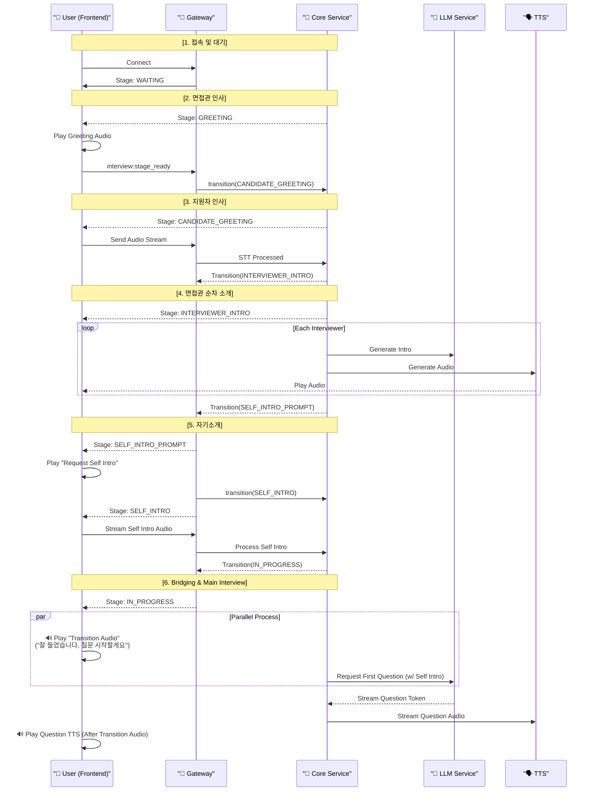
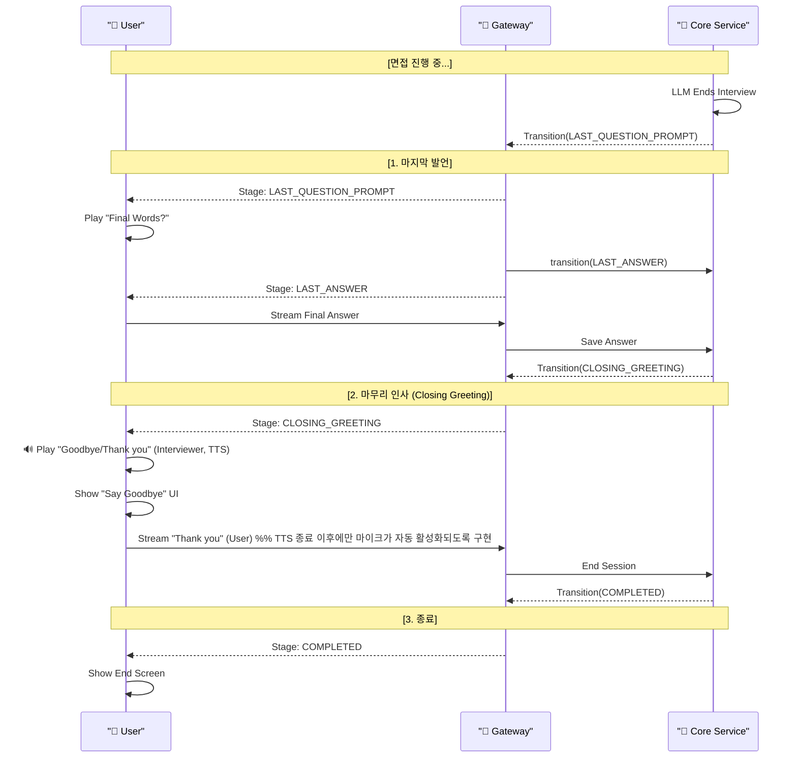

# AI 면접 흐름 유즈케이스 (Opening & Closing Sequence)

## 개요

이 문서는 AI 면접 시스템의 **초기 진입 단계(Opening)**와 **마지막 답변 및 종료 단계(Closing)**의 상세 흐름, 사용자 상호작용, 시스템 내부 로직을 설명합니다.

### High-Level Sequence Flow

```text
       [  WAITING  ]  --- (소켓 연결 및 권한 확인) --->
             |
      [   GREETING  ] --- (면접관 환영 인사) --->
             |
 [ CANDIDATE_GREETING ] --- (사용자 가벼운 인사) --->
             |
 [ INTERVIEWER_INTRO ] --- (면접관 순차 자기소개) --->
             |
[ SELF_INTRO_PROMPT ] --- (1분 자기소개 요청) --->
             |
    [  SELF_INTRO  ]  --- (사용자 자기소개 진행) --->
             |
    [  IN_PROGRESS  ] --- (본 면접 질의응답 사이클) --->
             |
[ LAST_QUESTION_PROMPT ] --- (마지막 질문/발언 안내) --->
             |
    [  LAST_ANSWER  ] --- (사용자 마지막 답변) --->
             |
  [ CLOSING_GREETING ] --- (상호 작별 인사) --->
             |
    [  COMPLETED  ]   --- (면접 세션 최종 종료)
```

---

## 1. Opening Sequence (면접 시작 ~ 본격 질의응답 전)

**목표**: 지원자가 면접 환경에 적응하고, 라포(Rapport)를 형성하며, 자연스럽게 본격적인 질의응답으로 이어지도록 합니다.

### 단계별 흐름

#### 1.1 면접 대기 및 연결 (WAITING)

- **User Action**: 면접방 입장.
- **System**: 소켓 연결, 미디어(카메라/마이크) 권한 확인.
- **Next Trigger**: 모든 준비 완료 시 `GREETING`으로 자동 전환.

#### 1.2 면접관 첫 인사 (GREETING)

- **System**:
  - 리드 면접관(MAIN)이 지원자를 환영하는 오디오 재생.
- **Transition**: 오디오 재생 완료 → `CANDIDATE_GREETING`

#### 1.3 지원자 가벼운 인사 (CANDIDATE_GREETING)

- **UI**: "면접관에게 가볍게 인사해주세요" 안내.
- **User Action**: "안녕하세요, 잘 부탁드립니다." 발화.
- **System**: 발화 종료(`isFinal`) 즉시 다음 단계로 전환.
- **Transition**: `CANDIDATE_GREETING` → `INTERVIEWER_INTRO`

#### 1.4 면접관 순차 소개 (INTERVIEWER_INTRO)

- **System (Sequential Intro)**:
  - 참여한 면접관들이 **정해진 순서대로** 자기소개를 진행.
  - Core:
    - `InterviewSession.roles`를 기반으로 `InterviewSessionState.participatingPersonas` 및 `nextPersonaIndex`를 Redis에 저장.
    - INTERVIEWER_INTRO 진입 시 **첫 번째 면접관(role 0)** 에 대해 LLM을 한 번 호출하여 소개 발화를 시작.
  - LLM/TTS:
    - LangGraph가 `next_speaker_id`(예: TECH, HR, LEADER)를 결정하고,
    - 해당 speakerId를 `currentPersonaId`로 내려주면서 질문/소개 텍스트를 스트리밍.
    - Core는 이 텍스트를 문장 단위로 잘라 TTS 큐에 넣고, TTS 서비스는 `persona`(=currentPersonaId)에 맞는 음성 톤으로 mp3를 생성.
  - Socket/Frontend:
    - `interview:audio` 이벤트로 문장별 TTS를 수신하고, `currentPersonaId`에 해당하는 면접관 카드에만 **speaking 하이라이트**를 준다.
  - 소개 한 턴이 끝나면(Core에서 LLM 스트림 완료 감지):
    - `InterviewerIntroFinishedEvent` 발행 → `InterviewSequentialIntroListener`가 다음 인덱스(`nextPersonaIndex`)의 면접관에 대해 LLM을 다시 호출.
    - 모든 면접관이 소개를 마치면 `SELF_INTRO_PROMPT` 단계로 자동 전환.
- **Transition**: 모든 소개 완료 → `SELF_INTRO_PROMPT`

#### 1.5 자기소개 요청 (SELF_INTRO_PROMPT)

- **System**:
  - **리드 면접관(또는 첫 번째 역할)** 이 1분 자기소개를 요청하는 안내 오디오를 재생하는 것으로 표현.
  - 프론트에서는 `interviewerRoles[0]` 를 active interviewer로 표시하여, 리드 면접관이 요청하는 것처럼 UI/하이라이트를 맞춘다.
- **Transition**: 오디오 재생 완료 → `SELF_INTRO`

#### 1.6 자기소개 진행 (SELF_INTRO)

- **UI**: 1분 30초 타이머, 색상 변화 (파랑 → 초록 → 빨강).
- **User Action**: 자기소개 발화.
- **Feature (Adaptive Retry)**:
  - **< 30s**: 재시도 요청 (최대 2회).
  - **> 90s**: 강제 종료 및 진행.
- **Transition**: 자기소개 완료 → `IN_PROGRESS`

#### 1.7 본격 시작 전환 (Bridging Sequence)

_`SELF_INTRO`에서 `IN_PROGRESS`로 넘어가는 사이의 공백을 메우기 위한 클라이언트 사이드 시퀀스입니다. 별도의 서버 상태(`Stage`)를 두기보다, 프론트엔드에서 상태 변경 직후 자연스러운 연결을 처리합니다._

1. **State Change**: 서버가 `IN_PROGRESS`로 상태 변경 알림.
2. **System (Background)**:
   - 서버는 받은 자기소개 내용을 포함하여 LLM에 **첫 번째 꼬리물기 질문 생성**을 요청하며,
   - 이 때 **리드 면접관(또는 첫 번째 역할)만 `availableRoles` 로 전달**하여 첫 Q&A가 반드시 리드 면접관이 진행되도록 강제합니다.
3. **UI (Foreground)**:
   - 프론트엔드는 **"Transition Audio"** (예: "네, 말씀 잘 들었습니다. 그럼 이제 질문을 시작하겠습니다.")를 즉시 재생합니다.
   - 이 오디오가 재생되는 시간(약 3~5초) 동안 LLM이 질문을 생성하고 TTS를 버퍼링합니다.
4. **Action**: Transition Audio 종료 후, 버퍼링된 첫 번째 질문 TTS를 이어서 재생합니다.

---

## 2. Closing Sequence (면접 종료 전)

**목표**: 면접을 급하게 끝내지 않고, 상호 인사를 통해 예의를 갖추며 마무리합니다.

### 단계별 흐름

#### 2.1 마지막 질문 (LAST_QUESTION_PROMPT)

- **Trigger**: LLM 종료 시그널 감지.
- **System**: "마지막으로 하고 싶은 말씀이나 질문이 있으신가요?" 오디오 재생.
- **Transition**: `LAST_ANSWER`

#### 2.2 마지막 답변 (LAST_ANSWER)

- **User Action**: 마지막 소감/질문 발화.
- **System**: 발화 내용 저장.
- **Transition**: `CLOSING_GREETING` (신규 제안 단계)

#### 2.3 마무리 인사 (CLOSING_GREETING)

_상호 작별 인사를 위한 단계입니다._

1. **System (Interviewer)**:
   - 면접관 마무리 멘트 재생 (예: "좋은 말씀 감사합니다. 오늘 면접 고생 많으셨습니다. 조심히 들어가세요.").
2. **UI**:
   - **"면접관에게 마지막 인사를 해주세요"** 문구 표시.
   - 마이크 활성화.
3. **User Action**:
   - "감사합니다", "수고하셨습니다" 등 끝인사 발화.
4. **System**:
   - 끝인사 감지 후(내용 무관) 세션 종료 처리.

- **Transition**: `COMPLETED`

#### 2.4 면접 종료 (COMPLETED)

- **UI**: 면접 종료 안내 및 나가기 버튼 활성화.

---

## 3. 시퀀스 다이어그램 (Mermaid)

### Opening Sequence (Start ~ In-Progress)



### Closing Sequence


