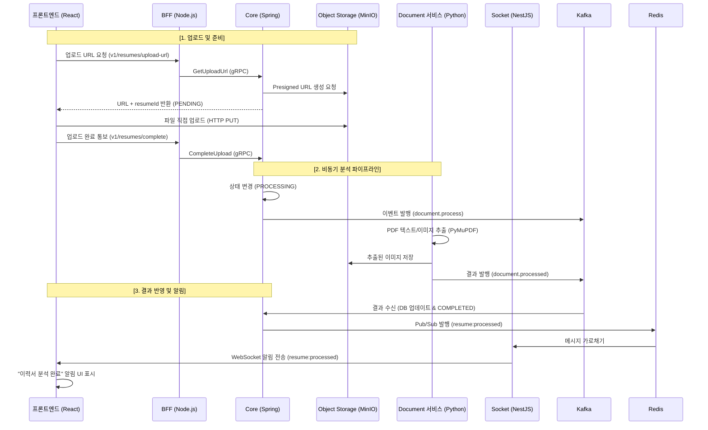

# 이력서 업로드 및 분석 파이프라인 유즈케이스 (Resume Analysis Pipeline)

## 개요

지원을 위해 이력서(PDF)를 업로드하면 시스템이 이를 자동으로 분석하여 텍스트와 이미지를 추출하고, 이를 기반으로 AI 면접관이 사전 지식을 갖출 수 있도록 비동기 파이프라인을 구축합니다. 이 과정은 사용자에게 실시간으로 진행 상황이 공유되어 끊김 없는 경험을 제공합니다.

---

## 1. 전체 프로세스 흐름 (End-to-End)

이 시스템은 보안과 효율성을 위해 **Presigned URL** 방식을 사용하며, 무거운 분석 작업은 **Kafka**를 통한 비동기 워커(`document` 서비스)가 처리합니다.

### 1단계: 업로드 준비 및 URL 발급 (BFF & Core)

- 지원자가 이력서 파일을 선택하면 프론트엔드는 BFF에 업로드 URL을 요청합니다.
- Core 서비스는 `Resumes` 엔터티를 `PENDING` 상태로 생성하고, Object Storage(MinIO)와 통신하여 5분간 유효한 **Presigned URL**을 발급받습니다.

### 2단계: 직접 업로드 (Client to Storage)

- 브라우저는 서버를 거치지 않고 발급받은 URL을 통해 Object Storage로 파일을 직접 업로드(`PUT`)합니다.
- 이는 서버의 트래픽 부담을 줄이고 대용량 파일 처리에 유리합니다.

### 3단계: 분석 요청 (Core to Kafka)

- 업로드가 완료되면 프론트엔드는 BFF에 완료를 알리고, Core는 이력서 상태를 `PROCESSING`으로 변경합니다.
- Core는 Kafka의 `document.process` 토픽으로 분석 요청 이벤트를 발행합니다.

### 4단계: 문서 분석 및 이미지 추출 (Document Worker)

- Python 기반의 `document` 서비스가 Kafka에서 요청을 수신합니다.
- **PyMuPDF (fitz)** 엔진을 사용하여 PDF에서 텍스트를 파싱하고, 포함된 모든 이미지를 고해상도로 추출합니다.
- 추출된 이미지는 다시 Object Storage에 저장되고, 분석 결과(텍스트 + 이미지 URL 목록)는 Kafka의 `document.processed` 토픽으로 발행됩니다.

### 5단계: 결과 반영 및 실시간 알림 (Core & Socket)

- Core 서비스가 결과를 수신하여 DB를 `COMPLETED` 상태로 업데이트하고 내용을 저장합니다.
- 동시에 Redis Pub/Sub을 통해 알림을 전송하면, Socket 서비스가 WebSocket을 통해 해당 사용자 브라우저에 `resume:processed` 이벤트를 보냅니다.
- 프론트엔드는 "분석 완료" 자막을 띄워 사용자에게 알립니다.

---

## 2. 시퀀스 다이어그램 (Mermaid)

---

## 3. 구성 요소 역할 (Component Responsibilities)

| 컴포넌트     | 기술 스택          | 주요 역할                                                              |
| :----------- | :----------------- | :--------------------------------------------------------------------- |
| **BFF**      | Node.js / NestJS   | REST API 게이트웨이, JWT 인증 처리, gRPC 클라이언트                    |
| **Core**     | Java / Spring Boot | 비즈니스 로직, 상태 관리(JPA), Kafka 전송 및 수신, Redis Pub/Sub 알림  |
| **Document** | Python / FastAPI   | PDF/이미지 처리(PyMuPDF), Kafka 소비자/생산자, 무거운 연산 처리        |
| **Socket**   | Node.js / NestJS   | 실시간 WebSocket 관리, Redis Pub/Sub 구독, 사용자 룸(`user-{id}`) 관리 |
| **Storage**  | Python / MinIO     | 파일 영구 저장소, Presigned URL 발급 인터페이스                        |

---

## 4. 데이터 모델 (핵심 필드)

- **Resume Status**: `PENDING`(URL 발급), `PROCESSING`(업로드 및 분석 중), `COMPLETED`(완료), `FAILED`(실패)
- **Extracted Content**: 추출된 원본 텍스트 (임베딩 및 검색에 활용)
- **Image URLs**: PDF 내에서 추출된 이미지들의 저장소 경로 리스트 (멀티모달 AI 입력을 위해 보존)
