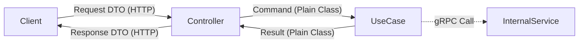

# BFF (Backend For Frontend) Service

BFF 서비스는 클라이언트(Frontend)와 내부 마이크로서비스(Core, LLM 등) 사이에서 API 게이트웨이 및 오케스트레이터 역할을 수행합니다.

## 🏗 아키텍처 원칙

### 1. 모듈화 (Modularity)

NestJS의 모듈 시스템을 기반으로 도메인별로 `modules/` 디렉토리에 격리합니다.

- 예: `modules/auth`, `modules/interview`, `modules/resume`, `modules/user`

### 2. 유스케이스 패턴 (UseCase Pattern)

비즈니스 로직의 복잡성을 관리하기 위해 모든 주요 행위는 `UseCase` 클래스로 정의합니다.

- **Command/Result**: 유효성 검사 및 데이터 전달을 위해 `Command`와 `Result` 클래스를 사용합니다.
- **일관성**: 항상 `new XxxCommand()`를 생성하여 `execute()`에 전달하는 패턴을 유지합니다.

### 3. 계층별 역할 (Layer Responsibilities)

각 레이어는 엄격하게 분리된 책임을 가집니다.

#### **Controller Layer**

- **역할**: 외부 진입점 및 응답 변환
- **허용**: HTTP 요청 수신, DTO 유효성 검사, Command 변환, UseCase 호출, Response DTO 변환
- **금지**: 직접적인 gRPC 서비스 호출, 비즈니스 로직 작성, DB 직접 접근

#### **UseCase Layer**

- **역할**: 비즈니스 로직 및 오케스트레이션
- **허용**: 비즈니스 규칙 실행, 여러 gRPC 서비스 호출 및 결과 조합, 도메인 데이터 가공
- **금지**: HTTP 객체(Res, Req) 참조, 직접적인 외부 인프라 기술 제어

#### **Infra / Adapter Layer**

- **역할**: 외부 시스템 연동 및 기술 구현
- **허용**: gRPC 클라이언트 통신, Redis/Kafka 연동, 기술적인 데이터 타입 변환
- **금지**: 비즈니스 의사결정 로직 포함, 다른 모듈의 도메인 로직 포함

### 4. 데이터 흐름 및 객체 유형 (Data Flow & Types)

BFF는 데이터의 흐름과 책임을 명확히 하기 위해 다음 4가지 객체 유형을 구분하여 사용합니다.



| 객체 유형        | 위치            | 역할                                                                                   |
| :--------------- | :-------------- | :------------------------------------------------------------------------------------- |
| **Request DTO**  | `dto/request/`  | 외부 클라이언트로부터 전달받는 HTTP Body/Query 데이터. `class-validator`가 적용됩니다. |
| **Command**      | `usecases/`     | UseCase 실행에 필요한 정규화된 입력값. 컨트롤러가 DTO나 인증 정보를 조합해 생성합니다. |
| **Result**       | `usecases/`     | UseCase 수행 결과 데이터. 도메인 단위의 순수 데이터를 담습니다.                        |
| **Response DTO** | `dto/response/` | 최종적으로 클라이언에게 반환될 HTTP 응답 구조. 필요시 데이터 가공이 이루어집니다.      |

### 5. gRPC 통신

내부 마이크로서비스와의 통신은 gRPC를 사용하며, `infra/grpc/services/`에 각 서비스별 전용 클라이언트를 위치시킵니다.

- **중요**: gRPC 클라이언트는 반드시 `OnModuleInit` 라이프사이클 훅에서 `getService()`를 호출해야 합니다.

## 📂 디렉토리 구조

```text
src/
├── core/             # 전역 필터, 인터셉터 등 핵심 인프라
├── infra/            # gRPC, Redis, Kafka 등 외부 연동 인프라
├── modules/          # 도메인 모듈 (auth, interview, resume, user)
│   └── [module]/
│       ├── controller.ts
│       ├── module.ts
│       ├── dto/      # HTTP 요청/응답 객체 (class-validator 활용)
│       └── usecases/ # 비즈니스 로직 (Command/Result 패턴)
└── types/            # 공통 타입 및 gRPC 정의
```

## 📝 코드 컨벤션

### 네이밍 규칙

| 항목               | 패턴              | 예시                                    |
| :----------------- | :---------------- | :-------------------------------------- |
| **Controller**     | `~.controller.ts` | `resume.controller.ts`                  |
| **Module**         | `~.module.ts`     | `resume.module.ts`                      |
| **UseCase**        | `~.usecase.ts`    | `get-resumes.usecase.ts`                |
| **DTO**            | `~.dto.ts`        | `create-resume.dto.ts`                  |
| **Command/Result** | 클래스명 접미사   | `GetResumesCommand`, `GetResumesResult` |

### API 설계 지침

- **Resource Naming**: 엔드포인트는 리소스 명사형을 사용합니다 (예: `GET /resumes`).
- **Standard Protocol**: 외부 클라이언트와는 `REST (HTTP)`로 통신합니다.
- **Versioning**: 모든 컨트롤러는 버전을 명시합니다 (`path: 'resumes', version: '1'`).

## 🔐 보안 아키텍처 (Security Architecture)

BFF는 시스템의 최전방에서 모든 보안 및 인증/인가를 총괄합니다. 이는 마이크로 서비스 아키텍처에서 흔히 발생하는 인증 로직의 중복을 방지하고 내부 서비스의 복잡성을 낮추기 위함입니다.

### 1. Gateway Offloading Pattern

- **역할 분담**: 내부 서비스(Core, LLM 등)는 토큰 검증이나 세션 관리에 신경 쓰지 않습니다. 대신 BFF가 모든 요청의 유효성을 검증하고 신뢰할 수 있는 사용자 정보(X-User-Id)만을 전달합니다.
- **장점**: 내부 서비스는 비즈니스 로직에만 집중할 수 있으며, 인증 기술(예: JWT에서 세션으로 변경 등)이 변경되어도 내부 서비스의 코드는 수정할 필요가 없습니다.

### 2. JWT 관리의 특수성 (Why our JWT is unusual?)

본 프로젝트의 JWT 구현은 일반적인 "Stateless" 방식과 달리 다음의 독특한 아키텍처를 가집니다.

- **JWKS 기반 동적 키 검증 (Dynamic Key Discovery)**:
    - BFF는 공개키를 설정 파일에 하드코딩하거나 로컬 파일로 관리하지 않습니다.
    - 대신 **Core 서비스의 JWKS 엔드포인트**(`JWT_JWKS_URI`)를 통해 런타임에 공개키를 동적으로 가져와 서명을 검증합니다.
    - 이를 통해 **키 로테이션(Key Rotation)**이 발생하더라도 BFF의 재구동이나 설정 변경 없이 즉시 새로운 키를 적용할 수 있는 유연한 보안 구조를 가집니다.
- **Stateful JWT (Redis 기반)**:
    - 표준 JWT는 한 번 발급되면 만료 전까지 무효화가 어렵지만, 본 시스템은 **Refresh Token을 Redis에 저장**하여 관리합니다.
    - 이를 통해 사용자가 로그아웃하거나 관리자가 강제 세션 종료를 수행할 때 토큰을 즉시 무효화(Revocation)할 수 있습니다.
- **BFF 독점 검증 (Gateway-only Verification)**:
    - 모든 JWT 검증 암호화 연산은 **BFF에서만 수행**됩니다.
    - 내부 마이크로서비스(Core 등)는 별도의 JWT 검증 로직을 중복으로 수행하지 않으며, BFF가 검증 후 전달한 `X-User-Id` 헤더 또는 gRPC 메타데이터를 신뢰하는 **Trusted Subnet** 모델을 채택했습니다. 이는 전체 시스템의 성능 최적화와 로직 단순화를 위함입니다.
- **BFF의 토큰 관리 대행 (Cookie-based Abstraction)**:
    - 클라이언트(Frontend)는 Access Token만 메모리에 보관하며, Refresh Token은 존재 자체를 알 필요가 없습니다.
    - BFF가 `HttpOnly`, `Secure` 쿠키를 통해 Refresh Token의 라이프사이클을 전담 관리함으로써, XSS 공격으로부터 토큰을 원천적으로 보호하고 프론트엔드 개발의 복잡성을 낮췄습니다.

### 3. 신원 전파 (Identity Propagation)

인증이 완료된 요청에 대해 BFF는 다음과 같은 방식으로 내부 서비스에 사용자 신원을 전파합니다.

- **gRPC Metadata**: gRPC 호출 시 메타데이터(Context)에 사용자 정보를 포함합니다.
- **Custom Header**: REST 또는 이벤트 기반 통신 시 `X-User-Id`와 같은 커스텀 헤더를 사용하여 인증된 사용자임을 보증합니다.
- **Trust Domain**: 내부 네트워크 내의 서비스들은 BFF가 보낸 사용자 정보를 기정사실로 신뢰하는 구조입니다.
