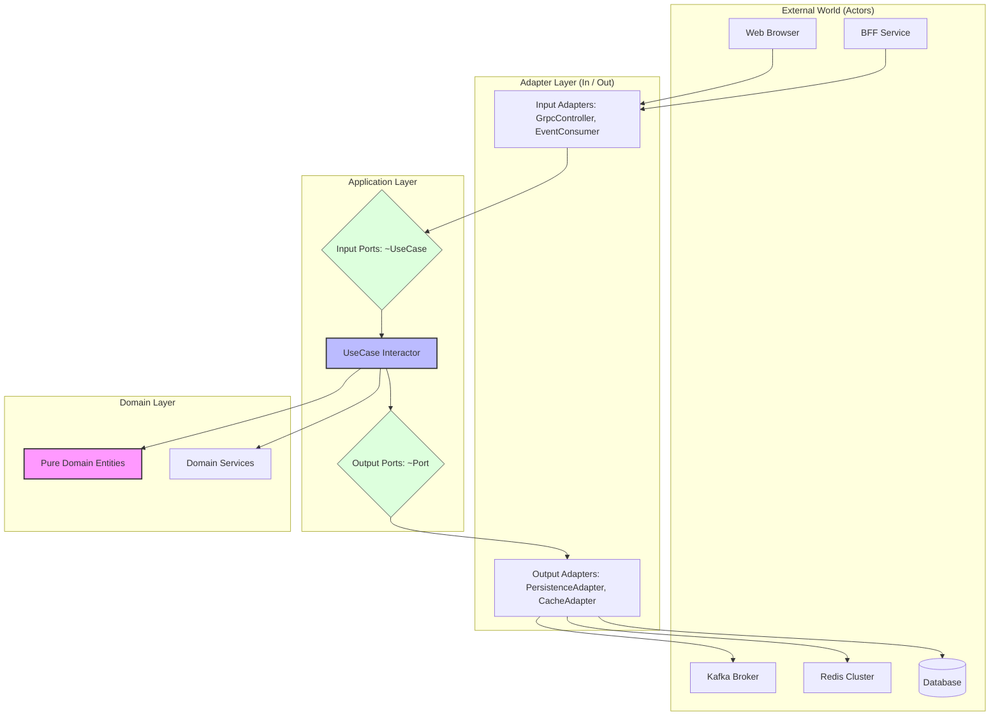

# Core Service

AI 면접 시스템의 핵심 도메인 로직을 담당하는 백엔드 서비스입니다. 면접 세션 관리, 사용자 데이터, 이력서 처리 및 LLM/STT/TTS 서비스와의 오케스트레이션을 수행합니다.

## 🚀 Key Features

- **면접 세션 오케스트레이션**: 면접의 진행 단계(Greeting -> Self-Intro -> In-Progress -> Closing)를 관리하고 상태 전이를 제어합니다.
- **도메인 데이터 관리**: 사용자(지원자/면접관), 이력서, 면접 결과 등의 핵심 엔티티를 관리합니다.
- **비동기 이벤트 처리**: Kafka와 Redis(Streams/Queue)를 통해 STT 전사 결과 처리 및 TTS 음성 생성 요청을 비동기로 처리합니다.
- **gRPC 인터페이스**: BFF 및 타 서비스에 고성능 통신 인터페이스를 제공합니다.
- **이력서 관리 오케스트레이션**: `document` 서비스와 Kafka로 연동하여 이력서 파싱 및 임베딩 처리를 조율합니다.
- **보안 및 인증**: RS256 비대칭 키 서명 방식의 JWT를 발급하며, Redis를 이용한 Refresh Token 관리와 키 로테이션을 지원합니다.

## 🔑 Security & Authentication (JWT)

본 서비스는 보안 강화를 위해 비대칭 키(RS256) 기반의 JWT 인증 시스템을 구축하였습니다.

### Token Specification

- **Algorithm**: `RS256` (RSA Signature with SHA-256)
- **Key Rotation**: `kid` (Key ID) 필드를 통한 멀티 키 지원 및 무중단 키 로테이션 가능
- **Access Token**:
  - 유효 기간: 30분 (기본값)
  - 포함 정보: `sub` (userId), `role`, `typ` (access)
- **Refresh Token**:
  - 유효 기간: 30일 (기본값)
  - 포함 정보: `sub` (userId), `typ` (refresh)
  - 저장소: Redis (`auth:refresh-token:{userId}`) - TTL 자동 관리

### JWKS (JSON Web Key Set)

- 타 서비스(BFF, Socket 등)에서 별도의 DB 조회 없이 공개키만으로 토큰을 검증할 수 있도록 설계되었습니다.

## 🛠 Tech Stack

- **Core**: Java 21, Spring Boot 4.0.1
- **Communication**: gRPC (Protobuf), Apache Kafka, Redis (Sentinel, Pub/Sub, Strings, Streams, Queue)
- **Database**: Oracle Cloud Database (Production), PostgreSQL with pgvector (Local)
- **ORM & Migration**: Spring Data JPA, Hibernate, Flyway
- **Tools**: Lombok, MapStruct, Apache Tika (Legacy/Support), JWT (jjwt)

## 🏗 Architecture & Directory Structure

본 서비스는 **Clean Architecture (Hexagonal Architecture)** 원칙을 준수합니다. 외부 기술로부터 도메인을 보호하고, 모든 의존성은 항상 안쪽(도메인)을 향하도록 설계되었습니다.

### 🔷 Hexagonal Architecture Pattern



### 🧱 Conceptual Visualization (ASCII Art)

```text
       [ Driving Actors ]              [ Driven Actors ]
      ( Web / BFF / Kafka )           ( DB / Redis / Kafka )
               |                               ^
  _____________|_______________________________|______________
 |             |        Adapter Layer          |              |
 |   [ In: ~GrpcController ]       [ Out: ~PersistenceAdapter ] |
 |   [ In: ~EventConsumer  ]       [ Out: ~CacheAdapter       ] |
 |_____________|_______________________________^______________|
               |                               |
  _____________|_______________________________|______________
 |             |       Application Layer       |              |
 |      < Input Port >                  < Output Port >       |
 |       (~UseCase)            |           (~Port)            |
 |                             v                              |
 |                    [ UseCase Interactor ]                  |
 |_____________________________|______________________________|
                               |
                _______________v_______________
               |         Domain Layer          |
               |    [ Pure Domain Entities ]   |
               |    [ Domain Services      ]   |
               |_______________________________|

             (Dependency Direction: Always Inward)
```

## 📝 Coding Conventions

### 1. Naming & Responsibility by Layer

| Layer           | Component      | Naming Pattern        | Responsibility                                         |
| :-------------- | :------------- | :-------------------- | :----------------------------------------------------- |
| **Domain**      | Entity         | `Name`                | 핵심 비즈니스 로직 및 규칙 보유 (JPA 의존성 없는 POJO) |
|                 | Service        | `~DomainService`      | 여러 엔티티에 걸친 비즈니스 로직 처리                  |
|                 | Exception      | `~Exception`          | 비즈니스 규칙 위반 시 발생하는 도메인 전용 예외        |
| **Application** | Input Port     | `~UseCase`            | 외부 레이어에 노출하는 유즈케이스 인터페이스           |
|                 | Output Port    | `~Port`               | 애플리케이션이 요구하는 인프라 기능 명세 (Port)        |
|                 | Implementation | `~Interactor`         | 유즈케이스 실제 구현체 (Not `~Service`)                |
|                 | DTO            | `~Command / ~Result`  | 유즈케이스 입력/출력 데이터 (application/dto)          |
| **Adapter**     | Input Adapter  | `~GrpcController`     | gRPC 요청 수신, Proto ↔ Command 변환                   |
|                 | Output Adapter | `~PersistenceAdapter` | Port 구현체, Domain ↔ JPA 변환 및 DB CRUD              |
|                 | JPA Entity     | `~JpaEntity`          | DB 테이블 매핑 전용 (adapter/out/persistence/entity)   |

### 2. Implementation & Directory Rules

새로운 도메인(예: `example`) 추가 시 아래의 표준 패키지 구조를 따릅니다.

```text
me.unbrdn.core.{domain}
├── adapter/
│   ├── in/grpc             - gRPC 컨트롤러
│   ├── in/messaging        - 메시지 구독 (Kafka/Redis)
│   ├── out/persistence     - RDB 영속성 어댑터 및 JpaEntity
│   └── out/cache           - Redis 캐시 어댑터
├── application/
│   ├── port/in             - 유즈케이스 인터페이스 (~UseCase)
│   ├── port/out            - 인프라 포트 (~Port)
│   ├── interactor          - 유즈케이스 구현체 (~Interactor)
│   └── dto                 - Command/Result 객체
└── domain/
    ├── entity              - 순수 도메인 객체
    ├── service             - 도메인 서비스
    └── exception           - 도메인 예외
```

## 📊 Data Flow Patterns

1. **Interview Lifecycle**:
   - BFF -> Core (gRPC): 면접 생성 및 세션 초기화
   - Socket -> Core (Redis Stream): 실시간 발화 내역 처리
   - Core -> LLM (gRPC Stream): 질문 생성 요청 및 스트리밍 결과 수신
   - Core -> TTS (Redis Queue): 생성된 문장 단위의 음성 변환 요청 (`interview:sentence:queue:tts`)

2. **Document Pipeline**:
   - Resume Upload -> Core -> Kafka Event (`resume.uploaded`)
   - Document Service (Consumer) -> Parse & Embedding -> Kafka Event (`document.processed`)
   - Core (Consumer) -> Status Update & Result Persistence

## 🚦 Getting Started

### Prerequisites

- JDK 21
- Docker & Docker Compose (for Kafka, Redis, PostgreSQL)

### Running Locally

```bash
./gradlew bootRun
```

### Build & Test

```bash
./gradlew build
./gradlew test
```

## 📝 Configuration

주요 설정은 `src/main/resources/application.properties` 및 프로파일별 설정 파일에서 관리됩니다.

- `application-local.properties`: PostgreSQL 기반 로컬 개발 환경
- `application-prod.properties`: Oracle Cloud DB 기반 운영 환경

---

> [!IMPORTANT]
> 인프라 변경 사항이나 주요 아키텍처 결정 사항은 `@docs/design-decisions.md`를 먼저 확인하세요.
