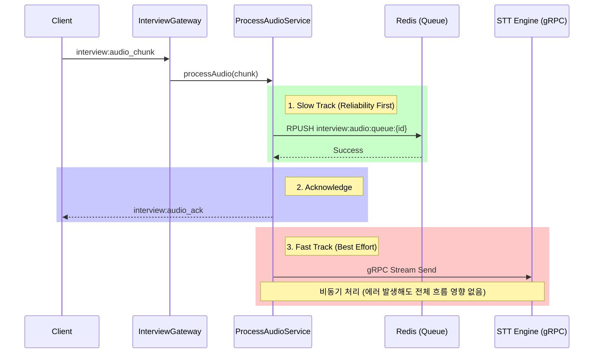

# 🔌 Socket Service Architecture

이 문서는 **Socket Service**의 내부 아키텍처, 데이터 흐름, 그리고 핵심 컨벤션을 정의합니다.

---

## 1. 🏛️ 개요 (Overview)

Socket Service는 클라이언트와의 **실시간 양방향 통신**을 담당하며, 특히 **음성 데이터(Audio Chunk)의 스트리밍 처리**에 특화되어 있습니다.

### 핵심 설계 원칙

1.  **신뢰성 우선 (Reliability First)**: 데이터 유실을 0으로 만드는 것을 최우선 목표로 합니다.
2.  **이중 트랙 전략 (Dual Track Strategy)**: **저장(Slow Track)**과 **실시간 처리(Fast Track)**를 분리하여 운영합니다.
3.  **관심사의 분리 (Separation of Concerns)**: 비즈니스 로직(Interview)과 기술 로직(STT)을 철저히 분리합니다.

---

## 2. 📦 모듈 구조 (Module Structure)

### 2.1 🎤 Interview Module

**역할**: 인터뷰 도메인의 비즈니스 로직 및 클라이언트 통신 창구.

- **`InterviewGateway`**: 클라이언트로부터 소켓 메시지(`interview:audio_chunk`)를 수신하는 진입점. 단순 라우팅 역할만 수행하며 로직은 Service로 위임합니다.
- **`InterviewConnectionListener`**: 소켓 연결/해제 이벤트를 감지하고 세션 유효성을 검증합니다.
- **`InterviewSttListener`**: 내부(EventBus)에서 `stt.transcript.received` 이벤트를 수신하여, 해당 인터뷰 룸의 클라이언트에게 최종 텍스트(`interview:stt_result`)를 전송합니다.

### 2.2 🗣️ STT Module

**역할**: 오디오 데이터 처리, 외부 STT 엔진 연동, 데이터 영속화.

- **`ProcessAudioService` (Orchestrator)**: 오디오 데이터 흐름을 제어하는 핵심 서비스. Fast/Slow 트랙을 조율합니다.
- **`SttGrpcService` (Fast Track)**: Python STT 엔진과 gRPC Streaming으로 연결되어 실시간 음성 인식을 수행합니다.
- **`SttStorageService` (Slow Track)**: 오디오 데이터를 Redis Queue에 안전하게 적재합니다. (추후 S3 등으로 백업)
- **`Consumers`**: STT 엔진에서 처리된 결과를 수신합니다.
    - `SttPubSubConsumer`: Redis Pub/Sub 채널 구독 (가벼운 메시지)
    - `SttStreamConsumer`: Redis Stream 구독 (신뢰성 있는 메시지 처리)

---

## 3. 🔄 데이터 흐름 (Data Flow) - Dual Track

오디오 처리는 **"저장이 완료된 후 처리를 시도한다"**는 철학을 따릅니다.

---

## 4. 📝 Naming Conventions

### 4.1 Socket Events (`domain:action`)

이벤트 명은 **Domain**과 **Action**을 콜론(`:`)으로 구분합니다.

| 종류                | 이벤트 명               | 설명                           |
| :------------------ | :---------------------- | :----------------------------- |
| **Client → Server** | `interview:audio_chunk` | 오디오 데이터 청크 전송        |
| **Server → Client** | `interview:audio_ack`   | 오디오 수신 및 저장 확인 (Ack) |
| **Server → Client** | `interview:stt_result`  | STT 변환 텍스트 결과 전송      |
| **Error**           | `interview:error`       | 인터뷰 도중 발생한 에러        |
| **Error**           | `connection:error`      | 연결 수립 단계의 에러          |

### 4.2 Redis Keys

Redis Key는 콜론(`:`)을 사용하여 계층 구조를 표현합니다.

- **Audio Queue**: `interview:audio:queue:{interviewSessionId}`
- **STT PubSub**: `stt:transcript:pubsub`
- **STT Stream**: `stt:transcript:stream`
- **Consumer Group**: `stt:transcript:group`

---

## 5. 🛠 기술 스택 (Tech Stack)

- **Framework**: NestJS (Current Version)
- **Protocol**: Socket.IO (WebSocket), gRPC (Internal)
- **Message Broker**: Redis (Pub/Sub & Streams & List)
- **Event Bus**: `@nestjs/event-emitter` (모듈 간 느슨한 결합용)

---

## 6. 개발 가이드 (Developer Guide)

### 새로운 소켓 기능 추가 시

1. **Gateway**: `InterviewGateway`에 `@SubscribeMessage('domain:action')` 추가.
2. **Service**: 비즈니스 로직은 반드시 Service 레이어에서 구현.
3. **Response**: 클라이언트 응답 시 `client.emit('domain:result', ...)` 사용.

### STT 처리 로직 수정 시

- `ProcessAudioService`는 **Orchestrator** 역할만 수행해야 합니다. 복잡한 비즈니스 로직이 추가된다면 별도 Service로 분리하세요.
- **Fast Track**과 **Slow Track**의 순서(`Slow -> Ack -> Fast`)를 변경하지 마십시오. 데이터 무결성이 깨질 수 있습니다.
