# AI 면접 오프닝 시퀀스 — 완전 기술 문서

---

## 전체 흐름 개요

```
WAITING → GREETING → CANDIDATE_GREETING → INTERVIEWER_INTRO → SELF_INTRO_PROMPT → SELF_INTRO → IN_PROGRESS
```

각 전환은 세 가지 트리거 중 하나로 발생한다:

| 트리거                  | 발생 조건                         |
| ----------------------- | --------------------------------- |
| 소켓 연결               | `socket.connected` 이벤트         |
| `interview:stage_ready` | 프론트엔드 TTS 완료 후 발행       |
| `interview:audio_chunk` | `isFinal=true` — 사용자 발화 종료 |

---

## STAGE 0 — WAITING (소켓 연결)

### ① 프론트엔드 → 소켓 게이트웨이

> `frontend/src/hooks/useInterviewSocket.ts:128`

```typescript
io(SOCKET_URL, {
  auth: { token: "Bearer <accessToken>" },
  query: { type: "INTERVIEW", interviewId: "<uuid>" },
  transports: ["websocket", "polling"],
});
// 이벤트: socket.connected (NestJS EventEmitter)
```

### ② 소켓 게이트웨이 → Java Core (gRPC)

> `socket/.../interview-connection.listener.ts:107`
> 함수: `InterviewConnectionListener.syncStandardSession()`

```typescript
// 1. 현재 stage 조회
stageService.getStage(interviewId);
// → gRPC: InterviewService.getInterviewStage({ interviewId })
// ← { stage: WAITING }

// 2. WAITING이면 GREETING으로 전환
stageService.transitionStage(interviewId, InterviewStage.GREETING);
// → gRPC: InterviewService.transitionStage({ interviewId, newStage: 2 })
```

### ③ Java Core — TransitionInterviewStageInteractor

> `services/domains/interview/.../TransitionInterviewStageInteractor.java:37`
> 함수: `execute(TransitionStageCommand { interviewId, newStage="GREETING" })`

```java
// 1. Redis에 currentStage=GREETING 저장
state.setCurrentStage(GREETING);
sessionStatePort.saveState(interviewId, state);

// 2. case GREETING → default: {} (별도 트리거 없음)

// 3. Redis Pub/Sub으로 STAGE_CHANGE 발행
publishTranscriptPort.publish(PublishTranscriptCommand {
  interviewId, type="STAGE_CHANGE",
  currentStage="GREETING", previousStage="WAITING"
})
```

### ④ 소켓 게이트웨이 → 프론트엔드

> `socket/.../interview-connection.listener.ts:110` (직접 emit)

```typescript
client.emit("interview:stage_changed", {
  interviewId,
  previousStage: "WAITING",
  currentStage: "GREETING",
});
// 참고: TranscriptPubSubConsumer도 Redis Pub/Sub을 구독 중이므로
//       STAGE_CHANGE가 룸 전체에도 브로드캐스트됨
```

---

## STAGE 1 — GREETING

### ⑤ 프론트엔드 처리

> `frontend/src/pages/Interview.tsx:810`

```typescript
// onStageChanged 핸들러 (setOnStageChanged)
if (e.currentStage === InterviewStage.GREETING) {
  const audioPath = getAudioPath("greeting", "greeting", personaKey, "edge");
  // → /audio/greeting/greeting_<personality>_edge.mp3

  ttsQueueRef.current.push({
    sentenceIndex: -1,
    localPath: audioPath,
    persona: activeRole,
  });
  playNextTts();
}

// playNextTts() 내부에서 오디오 재생 완료 후 turnEndTimeout (1500ms) 실행:
// Interview.tsx:667~712
startRecording(); // allowedStages에 GREETING 포함
notifyStageReady(InterviewStage.GREETING); // stagesRequiringReady에 포함
```

### ⑥ 프론트엔드 → 소켓 게이트웨이

> `frontend/src/hooks/useInterviewSocket.ts:207`

```typescript
socket.emit("interview:stage_ready", {
  interviewId: "<uuid>",
  currentStage: "GREETING",
});
```

### ⑦ 소켓 게이트웨이 — handleStageReady

> `socket/.../interview.gateway.ts`

```typescript
// SyncStageUseCase.execute(action="READY", currentStage="GREETING")
getNextStageByReady("GREETING") → InterviewStage.CANDIDATE_GREETING

stageService.transitionStage(interviewId, "CANDIDATE_GREETING")
// → gRPC: InterviewService.transitionStage({ newStage: 3 })
```

### ⑧ Java Core — TransitionInterviewStageInteractor

```java
execute(TransitionStageCommand { newStage="CANDIDATE_GREETING" })

// 1. Redis 상태 업데이트
state.setCurrentStage(CANDIDATE_GREETING);

// 2. STAGE_CHANGE 발행
publishTranscriptPort.publish({
  type="STAGE_CHANGE",
  currentStage="CANDIDATE_GREETING", previousStage="GREETING"
})
```

### ⑨ 소켓 게이트웨이 → 프론트엔드

> `socket/.../sync-stage.usecase.ts:71~77`

```typescript
// Redis: status = "LISTENING" 강제 세팅
redisClient.hset(`interview:${interviewId}:state`, "status", "LISTENING");

client.emit("interview:stage_changed", {
  previousStage: "GREETING",
  currentStage: "CANDIDATE_GREETING",
});
```

---

## STAGE 2 — CANDIDATE_GREETING

### ⑩ 프론트엔드 처리

> `Interview.tsx:831`

```typescript
} else if (e.currentStage === InterviewStage.CANDIDATE_GREETING) {
  // 오디오 없이 바로 녹음 시작
  startRecording()
}
// + autoRecordStages 효과에도 CANDIDATE_GREETING 포함 → 녹음 자동 시작
```

### ⑪ 사용자 발화 → 프론트엔드 VAD

> `Interview.tsx:471 (handleAudioLevel)`

```typescript
// VAD 로직: silenceDuration >= 1500ms && speechDuration >= 250ms → stopRecording()
stopRecording();
// → stop() (useAudioRecorder)
// → sendFinal() → socket.emit("interview:audio_chunk", { isFinal: true })
```

### ⑫ 프론트엔드 → 소켓 게이트웨이

```typescript
socket.emit("interview:audio_chunk", {
  chunk: "<base64 PCM>",
  interviewId: "<uuid>",
  isFinal: true,
  format: "pcm16",
  sampleRate: 16000,
});
```

### ⑬ 소켓 게이트웨이 — handleAudioChunk

> `socket/.../interview.gateway.ts:151`

```typescript
// 1. Redis status 검증
hget(`interview:${id}:state`, "status") === "LISTENING" ✓

// 2. 현재 stage 조회
stageService.getStage(interviewId) → { stage: "CANDIDATE_GREETING" }

// 3. 프로세서 라우팅
processorFactory.getProcessor("CANDIDATE_GREETING")
→ ProcessCandidateGreetingUseCase
```

### ⑭ ProcessCandidateGreetingUseCase

> `socket/.../process-candidate-greeting.usecase.ts:17`

```typescript
execute(AudioProcessingCommand { client, payload })

// 1. 오디오 처리 (STT)
audioProcessorService.processAudio(client, payload, "CANDIDATE_GREETING")
// → sttGrpcService.handleGrpcStream(...)
// → STT gRPC 스트림 → "stt.transcript.received" → interview:stt_result 전송

// 2. isFinal=true이면 다음 단계 전환
if (payload.isFinal) {
  stageService.transitionStage(interviewId, InterviewStage.INTERVIEWER_INTRO)
  // → gRPC: InterviewService.transitionStage({ newStage: 4 })

  client.emit("interview:stage_changed", {
    previousStage: "CANDIDATE_GREETING",
    currentStage: "INTERVIEWER_INTRO"
  })
}
```

### ⑮ Java Core — TransitionInterviewStageInteractor (INTERVIEWER_INTRO)

```java
execute(TransitionStageCommand { newStage="INTERVIEWER_INTRO" })
// case INTERVIEWER_INTRO → triggerInterviewerIntro(session, state)
```

### ⑯ triggerInterviewerIntro()

> `TransitionInterviewStageInteractor.java:113`

```java
// 1. 페르소나 목록 정규화 (중복 제거)
List<String> distinctPersonas = ["LEADER", "TECH"] // 예시

// 2. Redis 상태 업데이트
state.setNextPersonaIndex(1);  // 다음 소개는 1번(TECH)부터
state.setParticipatingPersonas(distinctPersonas);
sessionStatePort.saveState(interviewId, state);

// 3. 첫 번째 면접관(LEADER)에 대해 LLM 호출
callLlmPort.generateResponse(CallLlmCommand {
  interviewId,
  userText: "면접관님, 지원자에게 간단히 본인 소개를 해주세요...",
  inputRole: "system",
  personaId: "LEADER",
  stage: INTERVIEWER_INTRO,
  participatingPersonas: ["LEADER", "TECH"],  // 전체 목록
  ...
})
// → gRPC: LlmService.GenerateResponse(...)
```

---

## STAGE 3 — INTERVIEWER_INTRO (순차 소개)

### ⑰ LLM 서비스 — graph.py / nodes.py

```python
# LangGraph 실행

# nodes.router()에서:
if stage == "INTERVIEWER_INTRO":
    return {"next_speaker_id": roles[0]}  # → "LEADER"

# nodes.get_prompt_messages() → LEADER 역할 프롬프트 + 시스템 메시지
# ChatOpenAI.stream() 실행
```

### ⑱ LLM → Java Core → 소켓 → 프론트 (토큰 스트리밍)

> `Java: ProcessLlmTokenInteractor.execute(ProcessLlmTokenCommand)`

```java
// 매 토큰마다:
appendRedisCachePort.appendToken(interviewId, token, "LEADER")
appendRedisCachePort.appendSentenceBuffer(interviewId, token)

// Redis Pub/Sub으로 토큰 발행
publishTranscriptPort.publish({ token, currentPersonaId: "LEADER" })
// → TranscriptPubSubConsumer → socket.emit("interview:transcript", { currentPersonaId: "LEADER" })

// 문장 완성 시 (isSentenceEnd=true):
saveSentenceStreamPort.publishSentence(interviewId, "LEADER", sentenceIndex, sentence, ...)
pushTtsQueuePort.push({ interviewId, sentence, personaId: "LEADER" })
// → TTS 서비스 → audio 생성 → Redis Pub/Sub
// → AudioPubSubConsumer → socket.emit("interview:audio", { sentenceIndex, audioData, persona: "LEADER" })
```

### ⑲ LLM 완료 — handleFinalCompletion → 다음 면접관 트리거

> `ProcessLlmTokenInteractor.java:270`

```java
// isFinal=true, isEndSignal=false →
eventPublisher.publishEvent(InterviewerIntroFinishedEvent { interviewId, userId, mode })
```

> `InterviewSequentialIntroListener.java:31`

```java
handleInterviewerIntroFinished(event)

// 상태 조회: currentStage==INTERVIEWER_INTRO ✓
// nextIdx=1 < personas.size()=2 → 다음 소개 있음

String nextRoleName = personas.get(1); // "TECH"

// Redis: nextPersonaIndex = 2
state.setNextPersonaIndex(2);
sessionStatePort.saveState(interviewId, state);

// TECH 면접관 LLM 호출
callLlmPort.generateResponse(CallLlmCommand {
  userText: "앞선 면접관의 소개가 끝났습니다. 이제 면접관님의 차례입니다...",
  inputRole: "system",
  personaId: "TECH",
  participatingPersonas: ["TECH"],  // 현재 소개할 1명만 전달
  stage: INTERVIEWER_INTRO,
  ...
})
```

### ⑳ TECH 소개 완료 → 모든 면접관 소개 완료

```java
// handleInterviewerIntroFinished 재실행
// nextIdx=2 >= personas.size()=2 → 소개 완료

// lastInterviewerId를 첫 번째 페르소나(LEADER)로 리셋
state.setLastInterviewerId(personas.get(0)); // "LEADER"
state.setCurrentStage(SELF_INTRO_PROMPT);
sessionStatePort.saveState(interviewId, state);

// STAGE_CHANGE 발행
publishTranscriptPort.publish({
  type: "STAGE_CHANGE",
  currentStage: "SELF_INTRO_PROMPT",
  previousStage: "INTERVIEWER_INTRO"
})
// → TranscriptPubSubConsumer → 룸 브로드캐스트
// → socket.emit("interview:stage_changed", { currentStage: "SELF_INTRO_PROMPT" })
```

---

## STAGE 4 — SELF_INTRO_PROMPT

### ㉑ 프론트엔드 처리

> `Interview.tsx:874`

```typescript
} else if (e.currentStage === InterviewStage.SELF_INTRO_PROMPT) {
  const audioPath = getAudioPath("prompt", "self_intro_prompt", personaKey, engineKey)
  // → /audio/prompt/self_intro_prompt_<personality>_<edge|openai>.mp3

  const chunk = { sentenceIndex: -1, localPath: audioPath, persona: activeRole }

  // 레이스 컨디션 방지: LLM TTS가 아직 재생 중이면 지연
  if (ttsPlayingRef.current || ttsQueueRef.current.length > 0) {
    pendingStageAudioRef.current = chunk  // playNextTts()가 큐 빌 때 자동 추가
  } else {
    ttsQueueRef.current.push(chunk)
    playNextTts()
  }
}

// TTS 완료 → turnEndTimeout:
notifyStageReady(InterviewStage.SELF_INTRO_PROMPT)
// stagesRequiringReady = [GREETING, SELF_INTRO_PROMPT, LAST_QUESTION_PROMPT]
```

### ㉒ 소켓 게이트웨이 — SELF_INTRO_PROMPT → SELF_INTRO

```typescript
// SyncStageUseCase.execute(action="READY", currentStage="SELF_INTRO_PROMPT")
getNextStageByReady("SELF_INTRO_PROMPT") → InterviewStage.SELF_INTRO

stageService.transitionStage(interviewId, "SELF_INTRO")
// → gRPC transitionStage({ newStage: 6 })

// transitionStage 완료 후:
redisClient.hset(`interview:session:${id}`, "selfIntroStart", Date.now())
redisClient.expire(`interview:session:${id}`, 3600)
redisClient.hset(`interview:${id}:state`, "status", "LISTENING")

client.emit("interview:stage_changed", {
  previousStage: "SELF_INTRO_PROMPT", currentStage: "SELF_INTRO"
})
```

---

## STAGE 5 — SELF_INTRO

### ㉓ 프론트엔드 처리

> `Interview.tsx:835`

```typescript
} else if (e.currentStage === InterviewStage.SELF_INTRO) {
  setTimeLeft(90)              // 90초 타이머 시작
  setShowSelfIntroGuide(true)  // 안내 팝업 (3초 후 자동 닫힘)
  startRecording()
}
```

**타이머 Effect** (`Interview.tsx:1040`):

```typescript
// 1초마다 setTimeLeft(prev - 1)
// prev <= 1 (시간 종료) 시:
if (recordingRef.current) {
  stopRecording(); // VAD 아직 동작 중이면 정상 종료
} else {
  socket.emit("interview:skip_stage", {
    interviewId,
    currentStage: "SELF_INTRO",
  }); // VAD가 이미 멈췄으면 스킵 신호
}
```

**VAD 침묵 감지** (3500ms 기준):

```typescript
// handleAudioLevel → silenceDuration >= 3500ms → stopRecording()
stopRecording();
// → sendFinal() → socket.emit("interview:audio_chunk", { isFinal: true })
```

### ㉔ 소켓 게이트웨이 — SELF_INTRO 오디오 처리

```typescript
// getStage() → "SELF_INTRO"
// processorFactory.getProcessor("SELF_INTRO") → ProcessSelfIntroUseCase

audioProcessorService.processAudio(client, payload, "SELF_INTRO");
// → STT gRPC 스트림

if (payload.isFinal) {
  const elapsed = getSelfIntroElapsed(interviewId);
  // → Redis: hget("interview:session:${id}", "selfIntroStart")

  // 90초 초과 강제 전환 (타이머 오버런 안전장치)
  if (elapsed >= 90) {
    stageService.transitionStage(interviewId, "IN_PROGRESS");
    redisClient.hdel(`interview:session:${id}`, "selfIntroStart");
  }
  // 90초 미만이면 Java processUserAnswer에서 처리
}
```

### ㉕ STT 완료 → Java processUserAnswer

> `ProcessUserAnswerInteractor.java:39`

```java
execute(ProcessUserAnswerCommand { interviewId, userText, userId })

// 1. Status 가드
if (state.status != LISTENING) → DROP

// 2. Status = THINKING
state.setStatus(THINKING)

// 3. clear_turn 이벤트 발행 (프론트 UI 초기화)
publishTranscriptPort.publish({ type: "clear_turn", turnCount })

// 4. 사용자 메시지 저장
conversationHistoryPort.appendUserMessage(interviewId, "user", userText)

// 5. SELF_INTRO 특수 처리
if (state.currentStage == SELF_INTRO) {
  long elapsedSeconds = awaitElapsedSeconds(interviewId)
  // → Redis: hget("interview:session:{id}", "selfIntroStart")
  // → (현재시간 - startTime) / 1000

  int retryCount = getSelfIntroRetryCount(interviewId)
  boolean isSkip = userText.contains("자기소개 생략")  // 타이머 스킵 경로

  if (!isSkip && elapsedSeconds < 30 && retryCount < 2) {
    // ── RETRY 경로 ──
    incrementSelfIntroRetryCount(interviewId)

    publishTranscriptPort.publish({ type: "RETRY_ANSWER", content: "..." })
    // → socket.emit("interview:retry_answer")
    // → 프론트: retry_short.mp3 재생 + 타이머 90초 리셋

    // selfIntroStart 리셋 (재시도 시간부터 다시 측정)
    stringRedisTemplate.opsForHash().put(
      "interview:session:" + interviewId, "selfIntroStart", currentTimeMillis
    )
    state.setStatus(LISTENING)
    return  // LLM 호출 없이 종료

  } else {
    // ── 완료 경로 ──
    state.setCurrentStage(IN_PROGRESS)
    state.setSelfIntroText(userText)  // 자기소개 텍스트 보존

    publishTranscriptPort.publish({
      type: "STAGE_CHANGE",
      currentStage: "IN_PROGRESS", previousStage: "SELF_INTRO"
    })
    // → socket.emit("interview:stage_changed", { currentStage: "IN_PROGRESS" })
  }
}

// 6. LLM 호출 (첫 번째 질문)
callLlmPort.generateResponse(CallLlmCommand {
  interviewId, userText,
  stage: IN_PROGRESS,
  lastInterviewerId: "LEADER",  // InterviewSequentialIntroListener에서 리셋됨
  participatingPersonas: ["LEADER", "TECH"],
  ...
})
```

---

## STAGE 6 — IN_PROGRESS 진입 (Bridging)

### ㉖ 프론트엔드 — Transition Audio 재생

> `Interview.tsx:845`

```typescript
} else if (e.currentStage === InterviewStage.IN_PROGRESS) {
  setTimeLeft(null)  // SELF_INTRO 타이머 해제

  if (e.previousStage === InterviewStage.SELF_INTRO) {
    // 브리징 오디오 재생 (LLM 첫 질문 생성 시간 동안 자연스러운 연결)
    const transitionPath = getAudioPath("guide", "transition_intro", personaKey, "edge")
    // → /audio/guide/transition_intro_<personality>_edge.mp3

    ttsQueueRef.current.push({ localPath: transitionPath, persona: activeRole })
    playNextTts()
    // Transition Audio (~3초) 동안 LLM이 첫 질문 TTS 버퍼링
  }
}
// 이후 LLM TTS 청크가 interview:audio 이벤트로 도착
// → ttsQueueRef에 적재 → Transition Audio 완료 직후 자동 재생
```

---

## Mermaid 시퀀스 다이어그램

```mermaid
sequenceDiagram
  participant FE as 프론트엔드<br/>(Interview.tsx)
  participant WS as 소켓 게이트웨이<br/>(NestJS)
  participant Core as Java Core<br/>(Spring Boot)
  participant Redis as Redis
  participant LLM as LLM 서비스<br/>(Python/LangGraph)
  participant TTS as TTS 서비스

  Note over FE,TTS: ━━ WAITING → GREETING ━━

  FE->>WS: io.connect({ query: { type:"INTERVIEW", interviewId } })
  WS->>Core: gRPC getInterviewStage({ interviewId })
  Core-->>WS: { stage: WAITING }
  WS->>Core: gRPC transitionStage({ newStage: GREETING })
  Core->>Redis: STAGE=GREETING, STAGE_CHANGE pub
  Redis-->>WS: STAGE_CHANGE { GREETING }
  WS-->>FE: interview:stage_changed { GREETING }

  Note over FE,TTS: ━━ GREETING: 정적 오디오 재생 ━━

  FE->>FE: playNextTts()<br/>→ /audio/greeting/greeting_*.mp3 재생
  FE->>FE: turnEndTimeout(1500ms)<br/>→ notifyStageReady("GREETING")
  FE->>WS: interview:stage_ready { currentStage:"GREETING" }
  WS->>Core: gRPC transitionStage({ newStage: CANDIDATE_GREETING })
  Core->>Redis: STAGE=CANDIDATE_GREETING, STAGE_CHANGE pub
  Redis-->>WS: STAGE_CHANGE { CANDIDATE_GREETING }
  WS->>Redis: hset status=LISTENING
  WS-->>FE: interview:stage_changed { CANDIDATE_GREETING }

  Note over FE,TTS: ━━ CANDIDATE_GREETING: 사용자 가벼운 인사 ━━

  FE->>FE: startRecording()
  FE->>WS: interview:audio_chunk { isFinal:false, chunk:PCM... }
  FE->>WS: interview:audio_chunk { isFinal:true }
  WS->>WS: getStage() → CANDIDATE_GREETING<br/>→ ProcessCandidateGreetingUseCase
  WS->>Core: gRPC transitionStage({ newStage: INTERVIEWER_INTRO })
  Core->>Core: triggerInterviewerIntro()<br/>첫 면접관(LEADER) LLM 호출 준비
  Core->>LLM: gRPC GenerateResponse { personaId:"LEADER",<br/>userText:"면접관님, 본인 소개를...",<br/>stage:INTERVIEWER_INTRO }
  Core->>Redis: STAGE=INTERVIEWER_INTRO, nextPersonaIndex=1, STAGE_CHANGE pub
  Redis-->>WS: STAGE_CHANGE { INTERVIEWER_INTRO }
  WS-->>FE: interview:stage_changed { INTERVIEWER_INTRO }

  Note over FE,TTS: ━━ INTERVIEWER_INTRO: LEADER 자기소개 ━━

  loop LEADER 소개 스트리밍
    LLM-->>Core: token (스트리밍)
    Core->>Redis: appendToken / pub { token, currentPersonaId:"LEADER" }
    Redis-->>WS: transcript token
    WS-->>FE: interview:transcript { token, currentPersonaId:"LEADER" }
    opt 문장 완성 시
      Core->>TTS: gRPC 문장 TTS 생성
      TTS-->>Core: mp3 bytes
      Core->>Redis: pub { sentenceIndex, audioData }
      Redis-->>WS: audio chunk
      WS-->>FE: interview:audio { sentenceIndex, audioData, persona:"LEADER" }
      FE->>FE: ttsQueueRef.push() → playNextTts()
    end
  end

  LLM-->>Core: isFinal=true
  Core->>Core: handleFinalCompletion()<br/>→ InterviewerIntroFinishedEvent 발행
  Core->>Core: InterviewSequentialIntroListener<br/>nextIdx=1 < size=2 → TECH 소개 차례
  Core->>LLM: gRPC GenerateResponse { personaId:"TECH",<br/>participatingPersonas:["TECH"],<br/>stage:INTERVIEWER_INTRO }

  Note over FE,TTS: ━━ TECH 자기소개 (동일 패턴) ━━

  LLM-->>Core: TECH 소개 스트리밍 → TTS → FE
  LLM-->>Core: isFinal=true
  Core->>Core: InterviewerIntroFinishedEvent
  Core->>Core: InterviewSequentialIntroListener<br/>nextIdx=2 >= size=2 → 소개 완료!
  Core->>Redis: stage=SELF_INTRO_PROMPT, lastInterviewerId="LEADER"(리셋)
  Core->>Redis: pub STAGE_CHANGE { SELF_INTRO_PROMPT }
  Redis-->>WS: STAGE_CHANGE
  WS-->>FE: interview:stage_changed { SELF_INTRO_PROMPT }

  Note over FE,TTS: ━━ SELF_INTRO_PROMPT: 자기소개 요청 오디오 ━━

  alt LLM TTS 재생 중
    FE->>FE: pendingStageAudioRef = chunk<br/>(큐 빌 때까지 대기)
  else TTS 큐 비어있음
    FE->>FE: ttsQueueRef.push(self_intro_prompt.mp3)
    FE->>FE: playNextTts()
  end

  FE->>FE: 오디오 완료 → turnEndTimeout<br/>→ notifyStageReady("SELF_INTRO_PROMPT")
  FE->>WS: interview:stage_ready { currentStage:"SELF_INTRO_PROMPT" }
  WS->>Core: gRPC transitionStage({ newStage: SELF_INTRO })
  WS->>Redis: hset selfIntroStart=Date.now()
  WS->>Redis: hset status=LISTENING
  WS-->>FE: interview:stage_changed { SELF_INTRO }

  Note over FE,TTS: ━━ SELF_INTRO: 사용자 자기소개 (90초) ━━

  FE->>FE: setTimeLeft(90), startRecording()
  FE->>WS: interview:audio_chunk { chunks... }
  FE->>WS: interview:audio_chunk { isFinal:true }
  WS->>WS: getStage() → SELF_INTRO<br/>→ ProcessSelfIntroUseCase
  WS->>WS: getSelfIntroElapsed() → Redis selfIntroStart

  alt elapsed < 30초 && retryCount < 2
    WS->>Core: gRPC processUserAnswer { userText }
    Core->>Redis: pub RETRY_ANSWER
    Redis-->>WS: RETRY_ANSWER
    WS-->>FE: interview:retry_answer
    FE->>FE: setTimeLeft(90) 리셋<br/>retry_short.mp3 재생 후 재녹음
  else elapsed >= 30초 (정상 완료)
    WS->>Core: gRPC processUserAnswer { userText }
    Core->>Redis: selfIntroText 저장, stage=IN_PROGRESS
    Core->>Redis: pub STAGE_CHANGE { IN_PROGRESS }
    Redis-->>WS: STAGE_CHANGE
    WS-->>FE: interview:stage_changed { IN_PROGRESS }
    Core->>LLM: gRPC GenerateResponse {<br/>userText:"지원자가 자기소개를 마쳤습니다...",<br/>stage:IN_PROGRESS, lastInterviewerId:"LEADER" }
  end

  Note over FE,TTS: ━━ IN_PROGRESS: Bridging + 첫 질문 ━━

  FE->>FE: transition_intro.mp3 재생<br/>(LLM 첫 질문 버퍼링 시간 확보)
  LLM-->>Core: 첫 질문 토큰 스트리밍
  Core->>TTS: TTS 생성
  TTS-->>FE: interview:audio { 첫 질문 TTS }
  FE->>FE: Transition Audio 완료 → 첫 질문 TTS 재생
  FE->>FE: startRecording() → 질의응답 시작
```



---

## 핵심 상태 데이터 (Redis)

| Redis 키                 | 필드                  | 값                       | 기록 시점            |
| ------------------------ | --------------------- | ------------------------ | -------------------- |
| `interview:{id}:state`   | `status`              | `LISTENING` / `THINKING` | 매 전환마다          |
| `interview:{id}:state`   | `currentStage`        | stage 문자열             | 매 전환마다          |
| `interview:{id}:state`   | `nextPersonaIndex`    | 정수                     | INTERVIEWER_INTRO 중 |
| `interview:{id}:state`   | `lastInterviewerId`   | `"LEADER"` 등            | 매 LLM 완료 시       |
| `interview:session:{id}` | `selfIntroStart`      | timestamp (ms)           | SELF_INTRO 진입 시   |
| `interview:session:{id}` | `selfIntroRetryCount` | 정수                     | retry 시 증가        |
